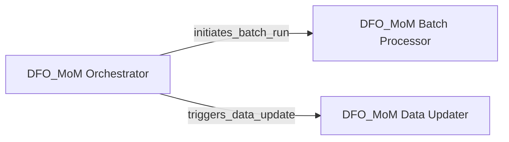

## Details

The `MoMProduction` system is designed as an operational module, `DFO_MoM`, which orchestrates and manages core data processing and update functionalities. Its main flow involves a central orchestrator (`DFO_MoM.main`) that initiates and coordinates both batch processing tasks (`DFO_MoM.batchrun_DFO_MoM`) and data update operations (`DFO_MoM.update_DFO_MoM`). This structure suggests a system focused on regular data handling and state maintenance, with the orchestrator serving as the primary control for its lifecycle and operations.

### DFO_MoM Orchestrator
Serves as the central control point for the DFO_MoM system, managing the overall execution flow and coordinating primary operations.

**Related Classes/Methods**:

- <a href="https://github.com/Global-Flood-Assessment/MoMProduction/blob/main/C:\Users\katri\Documents\GitHub\01_freelance\CodeBoarding\repos\MoMProduction\DFO_MoM.py#L314-L318" target="_blank" rel="noopener noreferrer">`DFO_MoM.main`:314-318</a>

### DFO_MoM Batch Processor
Responsible for executing scheduled or on-demand batch processing tasks within the DFO_MoM system, handling bulk data operations.

**Related Classes/Methods**:

- <a href="https://github.com/Global-Flood-Assessment/MoMProduction/blob/main/C:\Users\katri\Documents\GitHub\01_freelance\CodeBoarding\repos\MoMProduction\DFO_MoM.py#L300-L311" target="_blank" rel="noopener noreferrer">`DFO_MoM.batchrun_DFO_MoM`:300-311</a>

### DFO_MoM Data Updater
Manages the processes for updating data, configurations, or system states within the DFO_MoM application.

**Related Classes/Methods**:

- <a href="https://github.com/Global-Flood-Assessment/MoMProduction/blob/main/C:\Users\katri\Documents\GitHub\01_freelance\CodeBoarding\repos\MoMProduction\DFO_MoM.py#L33-L297" target="_blank" rel="noopener noreferrer">`DFO_MoM.update_DFO_MoM`:33-297</a>

### [FAQ](https://github.com/CodeBoarding/GeneratedOnBoardings/tree/main?tab=readme-ov-file#faq)