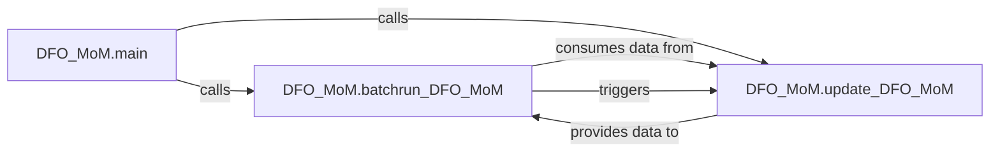

## Details

The DFO_MoM Core Processing subsystem is defined by the core operational logic encapsulated within the DFO_MoM.py file. Its boundaries are specifically marked by the main, batchrun_DFO_MoM, and update_DFO_MoM functions, which collectively manage the complete lifecycle of data processing and model execution for the DFO_MoM system.

### DFO_MoM.main
This component serves as the primary entry point for the entire DFO_MoM system. It is responsible for initializing the application and orchestrating the high-level execution flow, determining whether to initiate a batch run or perform a system update.

**Related Classes/Methods**:

- <a href="https://github.com/Global-Flood-Assessment/MoMProduction/blob/main/C:\Users\katri\Documents\GitHub\01_freelance\CodeBoarding\repos\MoMProduction\DFO_MoM.py#L314-L318" target="_blank" rel="noopener noreferrer">`DFO_MoM.main`:314-318</a>

### DFO_MoM.batchrun_DFO_MoM
This component encapsulates the logic for executing batch processes within the DFO_MoM system. It handles the sequential operations required for data processing or model execution in a batch mode, ensuring efficient and automated workflow.

**Related Classes/Methods**:

- <a href="https://github.com/Global-Flood-Assessment/MoMProduction/blob/main/C:\Users\katri\Documents\GitHub\01_freelance\CodeBoarding\repos\MoMProduction\DFO_MoM.py#L300-L311" target="_blank" rel="noopener noreferrer">`DFO_MoM.batchrun_DFO_MoM`:300-311</a>

### DFO_MoM.update_DFO_MoM
This component is responsible for managing all mechanisms related to updating the DFO_MoM system. This includes tasks suchs as data ingestion, model recalibration, configuration adjustments, or other state-modifying operations that ensure the system remains current and accurate.

**Related Classes/Methods**:

- <a href="https://github.com/Global-Flood-Assessment/MoMProduction/blob/main/C:\Users\katri\Documents\GitHub\01_freelance\CodeBoarding\repos\MoMProduction\DFO_MoM.py#L33-L297" target="_blank" rel="noopener noreferrer">`DFO_MoM.update_DFO_MoM`:33-297</a>

### [FAQ](https://github.com/CodeBoarding/GeneratedOnBoardings/tree/main?tab=readme-ov-file#faq)