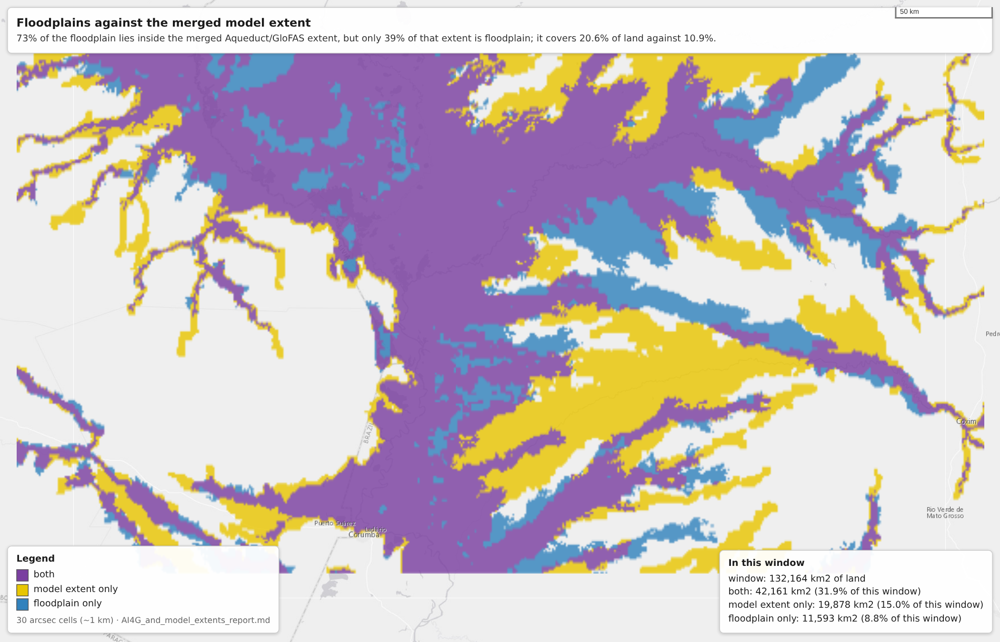
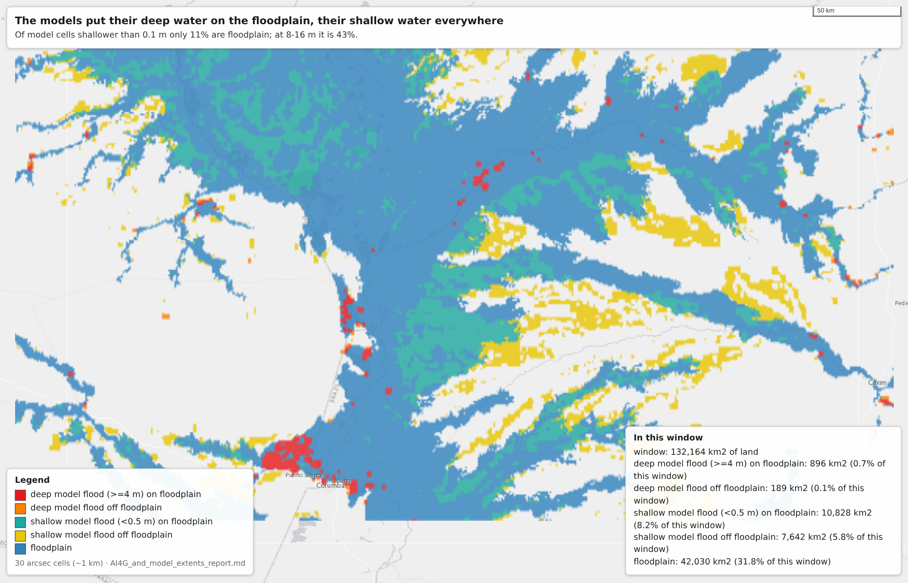
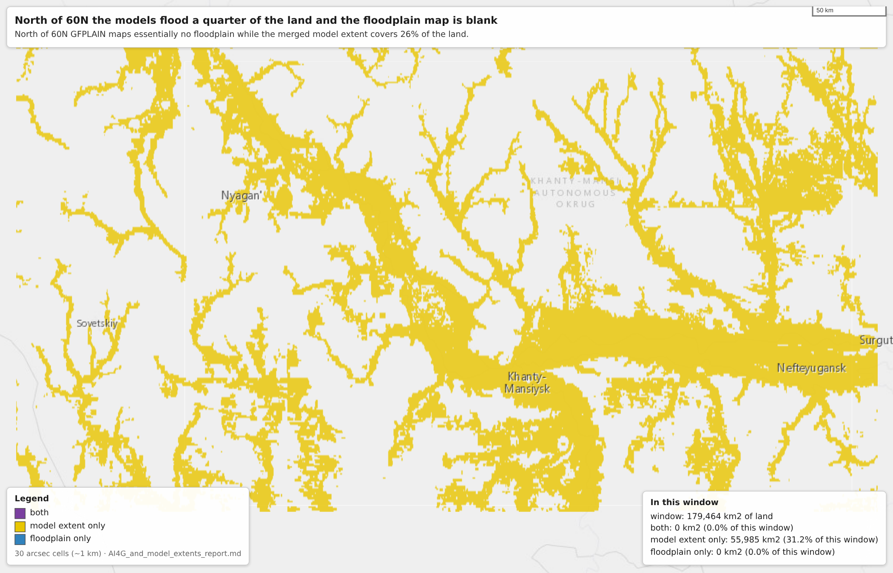
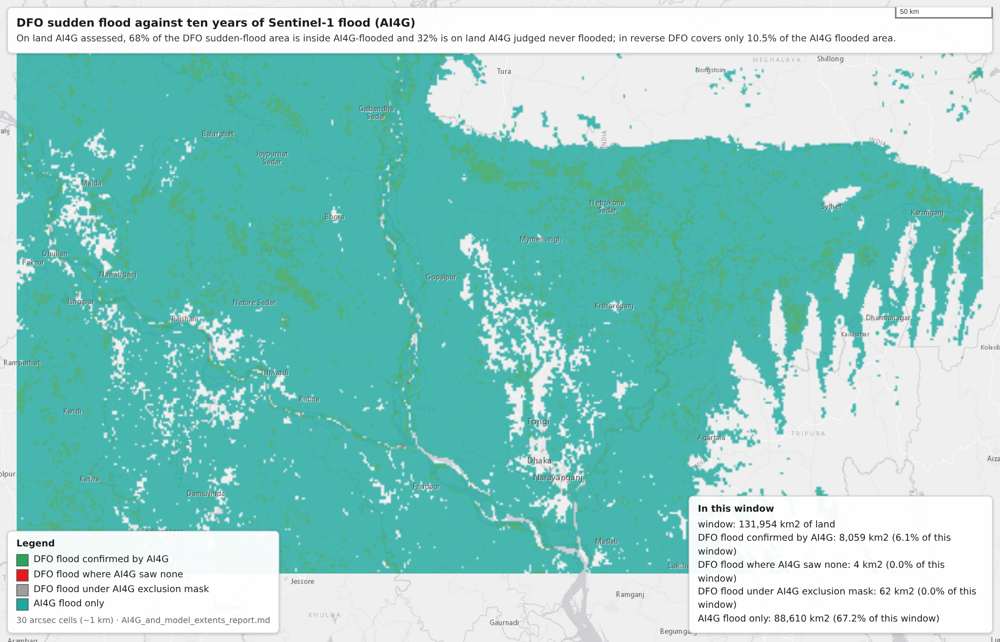
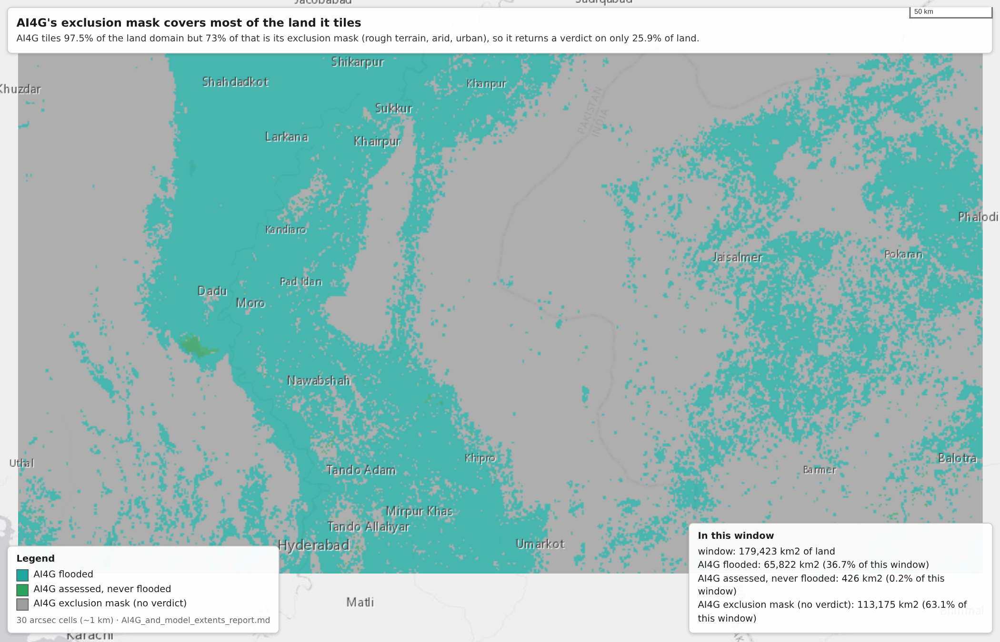
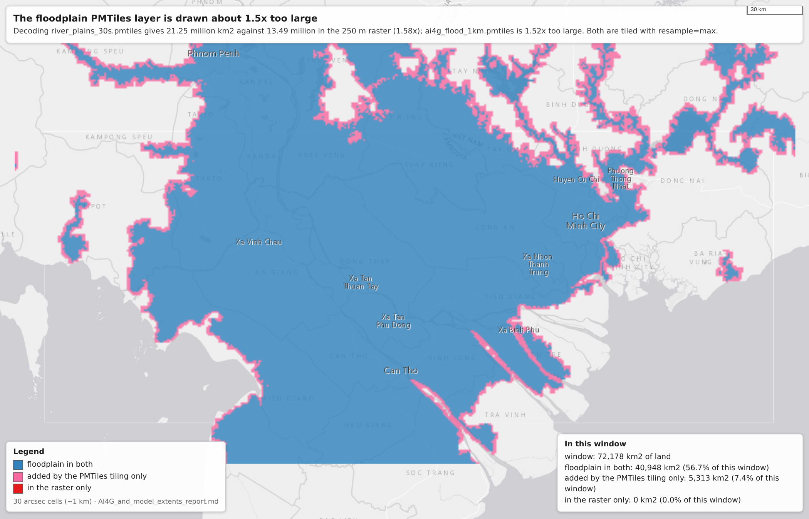
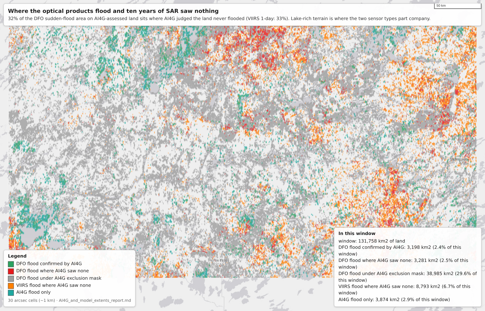

# AI4G SAR observations, modelled flood extents and river floodplains

**Questions**
1. How do river floodplains (GFPLAIN250m) relate to the merged "flood extent, any model" layer
   (Aqueduct riverine RP1000 OR Aqueduct coastal RP1000 OR GloFAS RP500)?
2. Do the DFO and VIIRS observations (1-day and 5-day composites, full range) lie inside the
   AI4G Sentinel-1 flood layer (2014-2024)?

Everything is put on one common 30 arcsec (~1 km) grid, the grid the Aqueduct and AI4G
rasters already use. DFO (1/480°) and VIIRS (0.003372°) are reduced onto it by assigning
every native pixel to the cell containing its centre, so neither is interpolated; the layers
that only exist as PMTiles in `MoM-map/data/persistent/` are decoded back from the archives.
Companion reports: [DFO_report.md](DFO_report.md), [VIIRS_report.md](VIIRS_report.md),
[DFO_vs_VIIRS_report.md](DFO_vs_VIIRS_report.md).

**This version uses the completed `ai4g_30s.tif` (22 MB, tiles over 97.5% of the land domain).**
An earlier draft of this report was built on a partial mosaic that had tiles over only 32% of
land, and it overstated the containment in Q2 by about 20 points, because the tiles that
existed were the flood-prone ones. Every AI4G number below was recomputed; the floodplain,
model-extent, DFO and VIIRS layers are unchanged.

## Summary

**Q1. Floodplains and the merged model extent are not the same map, and the model extent is twice as large.**
- Floodplain covers 10.9% of the land domain, the merged model extent 20.6%.
- 73% of the floodplain lies inside the model extent, but only 39% of the model extent is
  floodplain. Jaccard 0.34, risk ratio 5.2x.
- The agreement is strongly depth-dependent: of model cells less than 0.1 m deep only 11% are
  floodplain, rising monotonically to 43% at 8-16 m. Where the models put **deep** water they
  are mostly on a geomorphic floodplain; their shallow fringe is what makes them twice as big.
- In the tropics 80-88% of the floodplain is inside the model extent. North of 60°N GFPLAIN
  maps essentially **no** floodplain while the models flood 26% of the land, so there the
  floodplain carries no information at all.
- At watershed level the two rank watersheds only loosely: Spearman 0.40 between floodplain
  share and model-extent share, and only 50 of each one's 100 most-flooded watersheds are shared.

**Q2. Two thirds to seven eighths of the observed flood area falls inside AI4G - not all of it, and the gap is real, not a coverage artefact.**
- AI4G now tiles 97.5% of the land domain, but 73% of that is its own exclusion mask (rough
  terrain, arid, urban), so it returns a usable verdict - flooded or never flooded - on **25.9%**
  of the land. That is what limits this test now.
- On the land AI4G did assess: **68% of the DFO sudden-flood area, 88% of DFO recurrent, 67% of
  VIIRS 1-day and 64% of VIIRS 5-day lies inside AI4G-flooded**. Requiring 5+ flagged days
  raises it to 84% (DFO) and 83% (VIIRS 1-day): the longer-lasting the observed water, the more
  likely SAR saw it too.
- Counting all observed area, only 17% (DFO sudden) and 13-14% (VIIRS) sits on land AI4G
  assessed and judged never flooded. That is the real disagreement; the rest is either confirmed
  (37% DFO, 24-27% VIIRS) or under the exclusion mask (46-62%).
- The reverse fails, as expected for a 10-year union against 8-10 months: DFO sudden covers only
  10.5% of the AI4G flooded area, VIIRS 1-day 45%, VIIRS 5-day 52%. Jaccard 0.09 (DFO) to 0.20
  (VIIRS), so they remain far from interchangeable.
- AI4G flooded is itself large: 15.0 million km2, 12.2% of all land and 47% of the land it
  assessed. A decade of Sentinel-1 flags a lot.

**Is the floodplain a reliable way to say "the watershed flood will be here"?**
- As a prior, weakly, and it is now clearly beaten by the SAR record. Lift over other land:
  floodplain 2.5x (DFO sudden) / 3.5x (DFO recurrent) / 2.2x (VIIRS 1-day); merged model extent
  2.4x / 3.1x / 1.9x despite being twice the area; **AI4G flooded 3.0x / 4.3x / 2.2x**.
- The same ordering holds at watershed level, more sharply. Spearman against observed share:
  AI4G 0.50 (DFO) and 0.53 (VIIRS), floodplain 0.23 and 0.35, model extent 0.30 and 0.38. An
  actual decade of observations ranks watersheds roughly twice as well as either static map.
- 20-23% of the watersheds where a satellite saw flood have **no** floodplain mapped at all,
  while only 0.3-0.7% are outside the model extent: the model extent almost never says "nothing
  here", which is also why it discriminates so little.
- Restricted to the land AI4G assessed, every lift collapses to 1.4-2.2x, because that land is
  already flood-capable (floodplain is 23.4% of it, AI4G flooded 47%). On land where flooding is
  physically possible at all, none of these maps tells you where the water will go - they tell
  you where it *can* go.

## Areas, honestly: two of the PMTiles layers are inflated by their own tiling

Summing cover fractions instead of thresholding cells (`frac_area.py`) gives the true area of
each layer on the land domain:

| layer | area on land | note |
|---|---|---|
| GFPLAIN floodplain, from the 250 m raster | 13,491,065 km2 (10.93%) | reference |
| `river_plains_30s.pmtiles`, decoded | 21,250,280 km2 (17.22%) | **1.58x too large** |
| AI4G flooded, from `ai4g_30s.tif` | 15,011,105 km2 (12.16%) | reference |
| `ai4g_flood_1km.pmtiles`, decoded | 23,193,979 km2 (18.79%) | **1.52x too large** |
| `flood_extent_1km.pmtiles`, decoded | 25,686,182 km2 (20.81%) | matches its 50% threshold area, 20.6% |

Both inflated layers are the ones tiled with `resample="max"` (`build_ai4g_pmtiles.py`,
`build_river_plains_30s.py`), which is deliberate - it keeps them opaque when zoomed out - but
it means the map draws them about 1.5x larger than they are at zoom 7 and below. The depth
layers use `average` and are unbiased. Every number in this report therefore uses the **raster**
for floodplains and AI4G, and the 50% threshold for the model extent.

# Floodplains, modelled flood extents and SAR observations

All numbers are km2 of land on one common 30 arcsec (~1 km) grid, inside the
domain used by the earlier reports: MoM watershed land between 64.07N and
54.73S, where DFO, VIIRS and GFPLAIN all have coverage. A 30" cell counts as
land when at least half of it is land. Cell areas are true areas (cos lat), not cell counts.

| layer | what it is | km2 | share of land |
|---|---|---|---|
| (domain) | land in the domain | 123,425,922 | 100% |
| plain_any | GFPLAIN250m floodplain, any 250 m pixel in the cell | 16,701,625 | 13.5% |
| plain_maj | GFPLAIN250m floodplain over at least half the cell | 13,629,128 | 11.0% |
| plain_dec | floodplain from the PMTiles archive, >=50% of the cell (decode check) | 21,135,142 | 17.1% |
| extent_any | flooded in Aqueduct riverine RP1000, Aqueduct coastal RP1000 or GloFAS RP500 (>=1% of cell) | 30,960,853 | 25.1% |
| extent_maj | the same merged model extent over at least half the cell | 25,464,092 | 20.6% |
| ai4g_flood | AI4G: flooded at least once in Sentinel-1, 2014-2024 | 15,011,105 | 12.2% |
| ai4g_dec | AI4G flooded from the PMTiles archive, >=50% of the cell (decode check) | 22,831,557 | 18.5% |
| ai4g_mask | AI4G exclusion mask (rough terrain, arid, urban): not assessed | 88,277,588 | 71.5% |
| ai4g_cov | AI4G has a tile at all (0, 1 or 2, not 255) | 120,285,925 | 97.5% |
| dfo_sudden | DFO class 3 sudden flood, flagged on >=1 day (Jan-Aug 2026) | 4,318,877 | 3.5% |
| dfo_sud5 | DFO class 3 flagged on >=5 days | 741,304 | 0.6% |
| dfo_recur | DFO class 2 recurrent flood, >=1 day | 1,884,091 | 1.5% |
| viirs1d | VIIRS 1-day composite 141-200, >=1 day (full range) | 24,908,747 | 20.2% |
| viirs1d5 | VIIRS 1-day, >=5 days | 6,622,026 | 5.4% |
| viirs5d | VIIRS 5-day composite 141-200, >=1 day (full range) | 32,489,737 | 26.3% |
| viirs5d5 | VIIRS 5-day, >=5 days | 27,794,750 | 22.5% |

## Decode check

The floodplain and AI4G layers exist both as a raster and as PMTiles, so decoding
the archives can be checked against the real thing. Area ratio decoded/exact:

- floodplain: 21,135,142 vs 13,629,128 km2 (1.55x), 100.0% of the exact floodplain recovered
- AI4G flooded: 22,831,557 vs 15,011,105 km2 (1.52x), 100.0% of the exact flooded area recovered

The merged model extent only exists as PMTiles, so its area carries the same bias.

## AI4G coverage, and what actually limits the test

- AI4G has a tile over 97.5% of the land domain (120,285,925 km2).
- Of the covered land, 73.4% is the exclusion mask (rough terrain, arid or urban: Sentinel-1 was not trusted there), and
  12.5% was seen flooded at least once in 2014-2024.
- 2.5% of the land domain has no AI4G tile at all.
- So the layer has a usable verdict (flooded or never flooded) on only 25.9% of the land domain. That, not missing tiles, is
  what limits the comparison: the exclusion mask is where Sentinel-1 flood detection was
  not trusted (rough terrain, arid, urban), not where nothing flooded.

## Q1. River floodplains against the merged model extent

Merged model extent = Aqueduct riverine RP1000 OR Aqueduct coastal RP1000 OR GloFAS RP500,
i.e. your "flood extent, any model" layer. Both are static maps, so this is a pure
map-to-map comparison: no time, no observation.

| floodplain / model extent | floodplain km2 | extent km2 | both | of floodplain in extent | of extent on floodplain | Jaccard | risk ratio |
|---|---|---|---|---|---|---|---|
| plain_any / extent_any | 16,701,625 | 30,960,853 | 12,995,759 | 77.8% | 42.0% | 0.375 | 4.6x |
| plain_any / extent_maj | 16,701,625 | 25,464,092 | 11,963,002 | 71.6% | 47.0% | 0.396 | 5.7x |
| plain_maj / extent_any | 13,629,128 | 30,960,853 | 10,685,039 | 78.4% | 34.5% | 0.315 | 4.2x |
| plain_maj / extent_maj | 13,629,128 | 25,464,092 | 9,963,380 | 73.1% | 39.1% | 0.342 | 5.2x |

### By latitude (floodplain over half the cell, model extent >=1%)

| latitude | land km2-ish (cells) | floodplain | model extent | both | of floodplain in extent | of extent on floodplain |
|---|---|---|---|---|---|---|
| -60..-50 | 382,307 | 3.8% | 27.9% | 2.4% | 62.6% | 8.5% |
| -50..-40 | 1,618,323 | 8.7% | 19.3% | 4.9% | 56.0% | 25.1% |
| -40..-30 | 5,824,303 | 16.9% | 27.5% | 12.2% | 72.2% | 44.2% |
| -30..-20 | 11,995,012 | 10.2% | 27.4% | 8.3% | 80.8% | 30.2% |
| -20..-10 | 11,454,213 | 12.8% | 25.6% | 10.8% | 84.3% | 42.0% |
| -10..0 | 12,269,535 | 13.4% | 27.9% | 11.8% | 88.2% | 42.3% |
| 0..10 | 11,836,197 | 15.8% | 28.5% | 13.3% | 84.5% | 46.9% |
| 10..20 | 13,669,600 | 18.8% | 27.0% | 12.9% | 68.9% | 47.9% |
| 20..30 | 19,570,417 | 6.3% | 23.7% | 5.3% | 84.0% | 22.3% |
| 30..40 | 22,083,990 | 8.9% | 24.3% | 7.0% | 78.3% | 28.8% |
| 40..50 | 26,851,366 | 8.1% | 21.8% | 6.4% | 78.7% | 29.3% |
| 50..60 | 29,626,625 | 13.0% | 22.8% | 9.3% | 72.0% | 40.9% |
| 60..70 | 14,554,385 | 0.0% | 25.9% | 0.0% | n/a | 0.0% |

### Does the model put its deep water on the floodplain?

Cells of the merged model extent, by the deepest of the three models (flood_max).

| model depth | cells | on floodplain (half-cell) | on floodplain (any) |
|---|---|---|---|
| 0-0.1 m | 3,599,908 | 11.0% | 12.4% |
| 0.1-0.5 m | 7,609,775 | 25.8% | 29.1% |
| 0.5-1 m | 7,118,746 | 32.7% | 37.8% |
| 1-2 m | 9,127,147 | 34.6% | 41.7% |
| 2-4 m | 9,373,674 | 37.9% | 47.5% |
| 4-8 m | 5,963,179 | 42.0% | 53.7% |
| 8-16 m | 1,864,930 | 43.3% | 56.1% |
| 16-655.34 m | 440,082 | 35.1% | 49.8% |

## Q2. Do the DFO and VIIRS observations fall inside AI4G?

Only cells where AI4G has a tile are counted, and the AI4G classes are kept apart:
flooded (2), exclusion mask (1, not assessed) and observed-but-never-flooded (0).

| observed layer | km2 in AI4G-covered land | in AI4G flooded | in AI4G exclusion mask | in AI4G never flooded | outside AI4G coverage |
|---|---|---|---|---|---|
| dfo_sudden | 4,306,542 | 36.8% | 45.9% | 17.4% | 0.3% |
| dfo_sud5 | 734,026 | 51.4% | 38.6% | 10.0% | 1.0% |
| dfo_recur | 1,875,111 | 52.3% | 40.5% | 7.2% | 0.5% |
| viirs1d | 24,841,894 | 27.1% | 59.5% | 13.4% | 0.3% |
| viirs1d5 | 6,593,510 | 47.7% | 42.5% | 9.8% | 0.4% |
| viirs5d | 32,415,396 | 24.2% | 62.3% | 13.5% | 0.2% |
| viirs5d5 | 27,726,532 | 26.0% | 60.9% | 13.1% | 0.2% |

The exclusion-mask column is land AI4G did not assess, so the honest containment
test is the one that drops it:

| observed layer | km2 on land AI4G assessed (tile, not masked) | also AI4G flooded | AI4G never flooded |
|---|---|---|---|
| dfo_sudden | 2,330,724 | 67.9% | 32.1% |
| dfo_sud5 | 450,785 | 83.7% | 16.3% |
| dfo_recur | 1,115,973 | 87.8% | 12.2% |
| viirs1d | 10,062,665 | 66.9% | 33.1% |
| viirs1d5 | 3,791,917 | 83.0% | 17.0% |
| viirs5d | 12,212,560 | 64.3% | 35.7% |
| viirs5d5 | 10,846,561 | 66.4% | 33.6% |

Reverse direction, inside AI4G-covered land only:

| observed layer | of AI4G flooded also flagged | Jaccard with AI4G flooded | risk ratio |
|---|---|---|---|
| dfo_sudden | 10.5% | 0.089 | 3.2x |
| dfo_sud5 | 2.5% | 0.025 | 4.2x |
| dfo_recur | 6.5% | 0.062 | 4.4x |
| viirs1d | 44.8% | 0.203 | 3.1x |
| viirs1d5 | 21.0% | 0.170 | 4.6x |
| viirs5d | 52.3% | 0.198 | 3.0x |
| viirs5d5 | 48.0% | 0.203 | 3.1x |

## Which map best says where the water will be?

Lift = P(observed flood | predictor) / P(observed flood | all land in the domain).

| predictor | share of land | lift, dfo_sudden | lift, dfo_recur | lift, viirs1d | lift, viirs5d |
|---|---|---|---|---|---|
| plain_maj | 11.0% | 2.5x | 3.5x | 2.2x | 2.0x |
| plain_any | 13.5% | 2.4x | 3.2x | 2.1x | 1.9x |
| extent_any | 25.1% | 2.2x | 2.8x | 1.8x | 1.6x |
| extent_maj | 20.6% | 2.4x | 3.1x | 1.9x | 1.7x |
| ai4g_flood | 12.2% | 3.0x | 4.3x | 2.2x | 2.0x |

AI4G does not judge the land under its exclusion mask, so the row above mixes land it
assessed with land it skipped. The same table on the land it did assess:

| predictor | share of that land | lift, dfo_sudden | lift, dfo_recur | lift, viirs1d | lift, viirs5d |
|---|---|---|---|---|---|
| plain_maj | 23.4% | 1.5x | 1.9x | 1.6x | 1.5x |
| extent_any | 37.4% | 1.6x | 2.0x | 1.5x | 1.4x |
| extent_maj | 32.8% | 1.6x | 2.2x | 1.6x | 1.5x |
| ai4g_flood | 46.9% | 1.4x | 1.9x | 1.4x | 1.4x |

## Watershed level: does the floodplain rank the watersheds that flood?

14,607 MoM watersheds with more than 100 km2 inside the domain. For each one,
the share of its land that is floodplain, that the models flood, and that each
satellite product flagged.

| layer | watersheds with any | median share of watershed | mean share |
|---|---|---|---|
| plain_maj | 10,973 (75%) | 4.96% | 13.29% |
| extent_any | 14,446 (99%) | 21.44% | 28.20% |
| ai4g_flood | 13,189 (90%) | 6.47% | 13.87% |
| dfo_sudden | 12,627 (86%) | 1.57% | 4.03% |
| viirs1d | 13,941 (95%) | 14.21% | 22.04% |
| viirs5d | 14,023 (96%) | 21.36% | 28.18% |

Rank agreement between watershed shares (Spearman, all watersheds):

| | plain_maj | extent_any | ai4g_flood | dfo_sudden | viirs1d | viirs5d |
|---|---|---|---|---|---|---|
| plain_maj | 1.00 | 0.40 | 0.39 | 0.23 | 0.35 | 0.35 |
| extent_any | 0.40 | 1.00 | 0.37 | 0.30 | 0.38 | 0.36 |
| ai4g_flood | 0.39 | 0.37 | 1.00 | 0.50 | 0.53 | 0.52 |
| dfo_sudden | 0.23 | 0.30 | 0.50 | 1.00 | 0.67 | 0.67 |
| viirs1d | 0.35 | 0.38 | 0.53 | 0.67 | 1.00 | 0.97 |
| viirs5d | 0.35 | 0.36 | 0.52 | 0.67 | 0.97 | 1.00 |

Of the 100 watersheds with the largest flooded area in each product, how many are
also in the other's top 100:

| | plain_maj | extent_any | ai4g_flood | dfo_sudden | viirs1d | viirs5d |
|---|---|---|---|---|---|---|
| plain_maj | 100 | 50 | 26 | 10 | 25 | 22 |
| extent_any | 50 | 100 | 23 | 8 | 30 | 33 |
| ai4g_flood | 26 | 23 | 100 | 9 | 16 | 19 |
| dfo_sudden | 10 | 8 | 9 | 100 | 38 | 34 |
| viirs1d | 25 | 30 | 16 | 38 | 100 | 74 |
| viirs5d | 22 | 33 | 19 | 34 | 74 | 100 |

Watersheds where a satellite saw flood but the map says nothing:

| observed layer | watersheds with observed flood | of those, no floodplain mapped | of those, outside the model extent |
|---|---|---|---|
| dfo_sudden | 12,627 | 20.4% | 0.3% |
| viirs1d | 13,941 | 22.7% | 0.6% |
| viirs5d | 14,023 | 22.9% | 0.7% |

## How this was built

| script | what it does |
|---|---|
| `decode_pmtiles.py` | decodes a MoM-map PMTiles value raster (2% log index, Terrarium WebP, or a colour PNG) back to a global 30" GeoTIFF; `--mode fraction` keeps the percent of each cell covered, which is area preserving. Note the log round-trip: the class value 2 comes back as 1.9999, so filter with `--min-value 1.5`, not 2 |
| `reduce_to_30s.py` | reduces a native-grid accumulation or mask onto the 30" grid by pixel centre: pixels per cell, pixels ever flagged, and the largest day count in the cell |
| `joint_30s.py` | one pass over every 30" layer, packing one bit per layer per cell and counting the codes with true cell areas, so any combination of layers is a sum over one table; also per 10° latitude band, per 0.1° cell, and by model depth |
| `frac_area.py` | unbiased area of a percent-cover layer |
| `report_q1q2.py`, `watershed_stats.py` | the tables above |

Inputs: `dfo_accumulation/dfo_accumulater.tiff` (242 rasters, Jan-Aug 2026),
`viirs1day_full_accumulation/viirs_accumulater.tiff` (326 rasters),
`viirs5day_merged/viirs5day_full.tiff` (327 rasters), `dfo_accumulation/river_plains_mask.tiff`
and `dfo_land_mask.tiff`, and from `MoM-map/data/persistent/`: `ai4g/ai4g_30s.tif` and
`ai4g/ai4g_flood_1km.pmtiles` (complete versions, pulled 2026-10-07 12:22 UTC),
`flood_max/flood_extent_1km.pmtiles`, `flood_max/flood_max_1km.pmtiles`,
`river_plains/river_plains_30s.pmtiles`.

The partial-mosaic versions of the two AI4G files are kept beside them as
`ai4g_30s_partial_20261007.tif` and `ai4g_flood_1km_partial_20261007.pmtiles` in
`/root/validation_external/`, and the joint table of this run is
`report/data/joint_30s.npz`.

## Figures

One map per conclusion above, each on a small sample window, rendered in the same stack
as the MoM map itself (MapLibre GL with the OpenFreeMap positron basemap) and
screenshotted with Playwright. The classes are mutually exclusive and come from the very
rasters the report is computed from, so a figure can be read as a picture of one row of
one table. Every figure repeats its statistic for its own window, which is why those
numbers differ from the global ones: a window is chosen to show the effect, not to be
representative. Code: `figures_src/make_figures.py`, `figures_src/web/fig_page.html`,
`figures_src/shoot.js`.

### Floodplains against the merged model extent

73% of the floodplain lies inside the merged Aqueduct/GloFAS extent, but only 39% of that extent is floodplain; it covers 20.6% of land against 10.9%.

Window 19.2S-16.8S, 59.3W-54.7W, 30 arcsec cells (~1 km). window: 132,164 km2 of land:

- both: 42,161 km2 (31.9% of this window)
- model extent only: 19,878 km2 (15.0% of this window)
- floodplain only: 11,593 km2 (8.8% of this window)

### The models put their deep water on the floodplain, their shallow water everywhere

Of model cells shallower than 0.1 m only 11% are floodplain; at 8-16 m it is 43%.

Window 19.2S-16.8S, 59.3W-54.7W, 30 arcsec cells (~1 km). window: 132,164 km2 of land:

- deep model flood (>=4 m) on floodplain: 896 km2 (0.7% of this window)
- deep model flood off floodplain: 189 km2 (0.1% of this window)
- shallow model flood (<0.5 m) on floodplain: 10,828 km2 (8.2% of this window)
- shallow model flood off floodplain: 7,642 km2 (5.8% of this window)
- floodplain: 42,030 km2 (31.8% of this window)

### North of 60N the models flood a quarter of the land and the floodplain map is blank

North of 60N GFPLAIN maps essentially no floodplain while the merged model extent covers 26% of the land.

Window 60.2N-63.0N, 62.5E-73.4E, 30 arcsec cells (~1 km). window: 179,464 km2 of land:

- both: 0 km2 (0.0% of this window)
- model extent only: 55,985 km2 (31.2% of this window)
- floodplain only: 0 km2 (0.0% of this window)

### DFO sudden flood against ten years of Sentinel-1 flood (AI4G)

On land AI4G assessed, 68% of the DFO sudden-flood area is inside AI4G-flooded and 32% is on land AI4G judged never flooded; in reverse DFO covers only 10.5% of the AI4G flooded area.

Window 23.2N-25.6N, 87.8E-92.6E, 30 arcsec cells (~1 km). window: 131,954 km2 of land:

- DFO flood confirmed by AI4G: 8,059 km2 (6.1% of this window)
- DFO flood where AI4G saw none: 4 km2 (0.0% of this window)
- DFO flood under AI4G exclusion mask: 62 km2 (0.0% of this window)
- AI4G flood only: 88,610 km2 (67.2% of this window)

### AI4G's exclusion mask covers most of the land it tiles

AI4G tiles 97.5% of the land domain but 73% of that is its exclusion mask (rough terrain, arid, urban), so it returns a verdict on only 25.9% of land.

Window 25.2N-28.0N, 66.6E-72.4E, 30 arcsec cells (~1 km). window: 179,423 km2 of land:

- AI4G flooded: 65,822 km2 (36.7% of this window)
- AI4G assessed, never flooded: 426 km2 (0.2% of this window)
- AI4G exclusion mask (no verdict): 113,175 km2 (63.1% of this window)

### The floodplain PMTiles layer is drawn about 1.5x too large

Decoding river_plains_30s.pmtiles gives 21.25 million km2 against 13.49 million in the 250 m raster (1.58x); ai4g_flood_1km.pmtiles is 1.52x too large. Both are tiled with resample=max.

Window 9.6N-11.6N, 103.9E-107.7E, 30 arcsec cells (~1 km). window: 72,178 km2 of land:

- floodplain in both: 40,948 km2 (56.7% of this window)
- added by the PMTiles tiling only: 5,313 km2 (7.4% of this window)
- in the raster only: 0 km2 (0.0% of this window)

### Where the optical products flood and ten years of SAR saw nothing

32% of the DFO sudden-flood area on AI4G-assessed land sits where AI4G judged the land never flooded (VIIRS 1-day: 33%). Lake-rich terrain is where the two sensor types part company.

Window 54.6N-57.0N, 105.5W-97.5W, 30 arcsec cells (~1 km). window: 131,758 km2 of land:

- DFO flood confirmed by AI4G: 3,198 km2 (2.4% of this window)
- DFO flood where AI4G saw none: 3,281 km2 (2.5% of this window)
- DFO flood under AI4G exclusion mask: 38,985 km2 (29.6% of this window)
- VIIRS flood where AI4G saw none: 8,793 km2 (6.7% of this window)
- AI4G flood only: 3,874 km2 (2.9% of this window)
