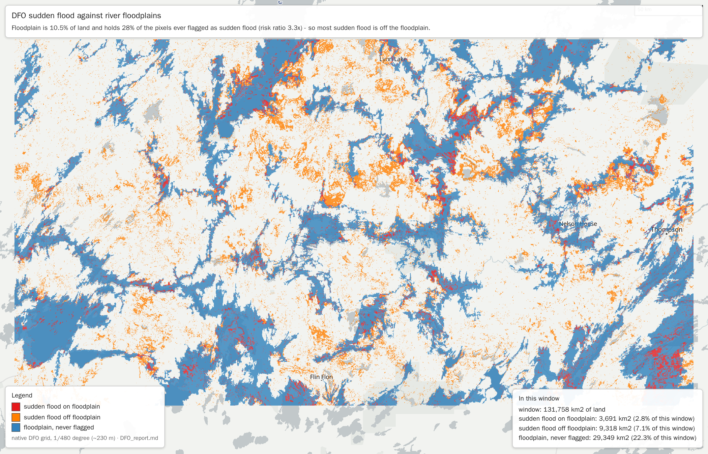
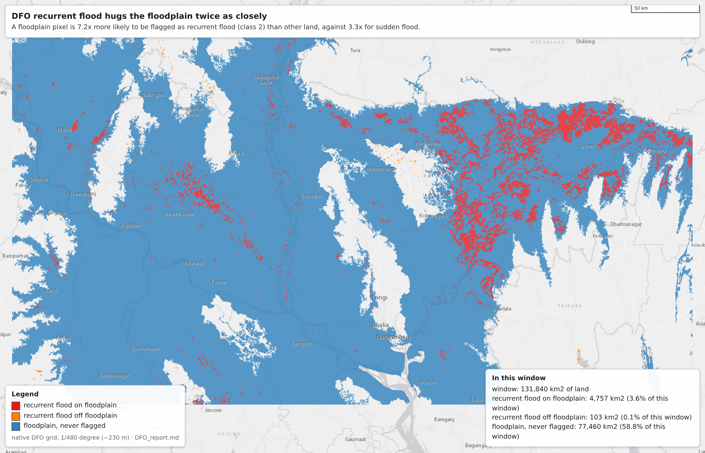
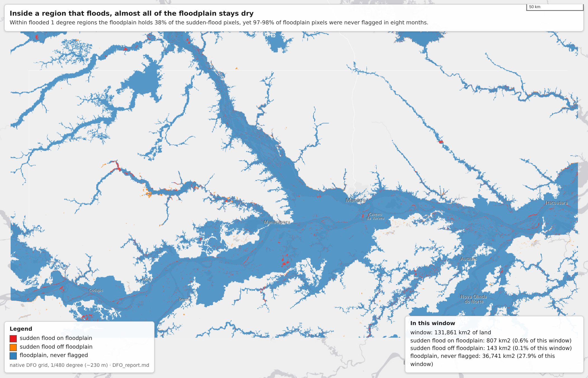
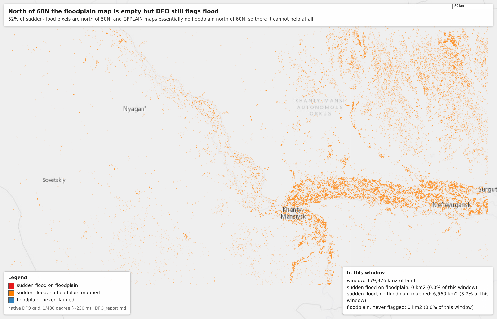
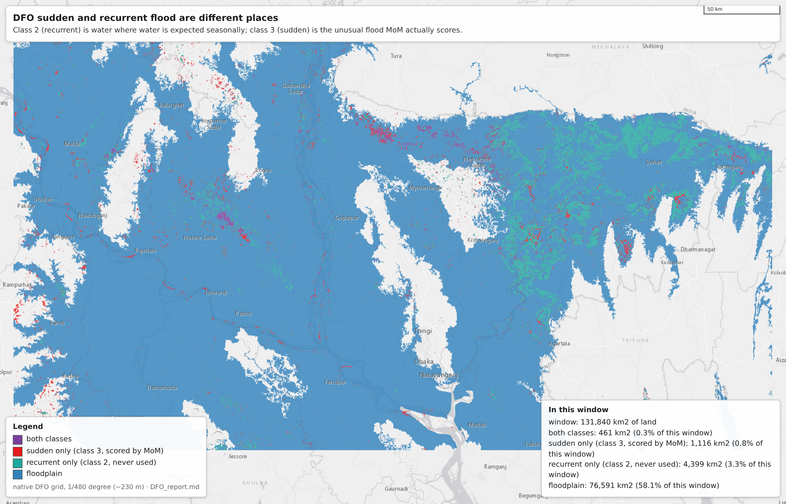

# DFO floods and river floodplains

**Question:** how much do DFO's sudden floods (MCDWD class 3) and recurrent floods (class 2) overlap with river floodplains (GFPLAIN250m)? And inside a region that floods, does the floodplain tell you where the water will be?

**Data:** 242 daily DFO rasters (NASA LANCE MCDWD "Flood 3-Day 250m", as staged by MoM), 2026-01-01 to 2026-08-31, accumulated per pixel into two counts:
- **band 1, sudden flood:** the number of rasters in which the pixel was class 3, "flood (unusual)";
- **band 2, recurrent flood:** the number of rasters in which it was class 2, "recurring flood (regular, seasonal inundation)".

"Flooded" below means flagged in at least one raster.

**How the MoM pipeline uses DFO.** For each of the four MCDWD layers (Flood 1-Day, 1-Day CS, 2-Day and 3-Day 250m), `dfo_extract_by_mask()` in `DFO_tool.py` counts only pixels with `data == 3` per watershed. That count becomes the `*_TotalArea_km2` and `*_perc_Area` fields that `DFO_MoM.py` scores. Class 2 is never used. Of these, only the **3-Day** layer is kept as images (`DFO_image/DFO_YYYYMMDD_Flood_3-Day_250m.tiff`). The other layers survive only as per-watershed areas, so the accumulation, and this analysis, are built from the 3-Day layer.

## Summary

1. **Floodplains are enriched, but most DFO flood is off them.** Floodplain is 10.5% of the land domain.
   - It holds 28% of the pixels ever flagged as sudden flood and 46% of the recurrent ones.
   - A floodplain pixel is 3.3x more likely than other land to be flagged as sudden flood, and 7.2x more likely for recurrent flood.
   - Weighted by days flooded, the floodplain holds 40% of sudden and 48% of recurrent flood-days.
2. **Recurrent floods follow the floodplain about twice as closely as sudden floods.** That fits their definition: class 2 is water where water is expected seasonally.
3. **Inside a region that floods, the floodplain still helps locate the water, but only as a coarse prior.**
   - Within flooded 1° regions, the floodplain is 14% of the land but holds 38% of the sudden-flood pixels and 58% of the recurrent ones (risk ratio 3.8x and 8.5x).
   - Even so, 97–98% of floodplain pixels in those regions were *never* flagged in eight months. "The floodplain" is far too large to be a flood map.
   - 26% (sudden) and 22% (recurrent) of flood pixels sit in flooded 1° regions that contain no mapped floodplain at all.
4. **Latitude matters.** 52% of sudden-flood pixels are north of 50°N.
   - There the enrichment is weakest (3.3x at 50–60°N), and GFPLAIN maps essentially no floodplain north of 60°N, so it can't help at all.
   - In the tropics and subtropics (20°S–40°N) floodplains hold 38–66% of sudden-flood pixels, with risk ratios of 5.6–10.6x.
5. **The grid makes no difference.** Running everything on the VIIRS grid, with DFO resampled by nearest neighbour, gives the same figures to within rounding.

## Analysis domain, and why the earlier river-plain reports overstated the effect

A pixel is in the domain if all of the following hold:
- it is **land** (inside a MoM watershed polygon);
- it is inside the GFPLAIN250m continental footprints, which end at 64.1°N;
- it was observed by at least 80% of the DFO rasters **and** at least 80% of the VIIRS rasters. South of 50°S only 183 of the 242 DFO rasters have coverage, so the domain is effectively **50°S to 64.1°N**.

Every layer and both products use this same domain, so their numbers can be compared directly.

**Why the land mask matters.** GFPLAIN maps floodplains only on land. But the source raster still stores a value everywhere: `0` is floodplain and `255` is "everything else". That second value covers non-floodplain land, the ocean and areas outside the tiles alike. The earlier reports (`dfo_accumulation/flood_vs_river_plains_report.md`, `viirs_accumulation/viirs_vs_river_plains_report.md`) used the continental bounding boxes as their domain. Those boxes are mostly sea; the Oceania box, for example, spans 139°W–180°E and 55°S–19°N. Ocean can never be flagged as flood, yet it was counted as "off floodplain". That pushed the off-floodplain flood rate down and every enrichment figure up.

| | old box domain | land-only domain (this report) |
|---|---|---|
| DFO grid pixels | 8,382,631,118 | 2,871,713,525 (34%) |
| VIIRS grid pixels | 3,330,051,622 | 1,096,128,286 (33%) |
| floodplain share of domain | 3.6% | 10.5% |
| risk ratio, DFO sudden (class 3) | 10.5x | **3.3x** |
| risk ratio, DFO recurrent (class 2) | 22.4x | **7.2x** |
| risk ratio, VIIRS 141-200 | 10.3x | **3.2x** |

The share of flooded pixels lying on floodplain doesn't change (28.2%, 45.9% and ~27%), because the numerator is the same. Only the denominator changes. Restricting the domain to land roughly divides the enrichment by three.

**Bin bug in the earlier reports.** The "floodplain share of a 0.1° cell" tables in the old reports are shifted by one bin. `np.digitize(..., right=True)` assigned cells with a (0, 1%] floodplain share to the "0%" row, and every later row likewise holds the next bin's cells. That is why ">75-100%" always showed 0 cells while ">50-75%" held the largest count. The tables below use correct bins. For example, the old ">50-75%" row's 70,563 cells correspond to the 70,691 cells in the ">75-100%" row here; the small difference comes from the land-only domain.

## Overlap with floodplains, whole domain

"P(flood | floodplain)" is the share of floodplain pixels flagged at least once. The risk ratio is that share divided by the same share for the rest of the land. "Flood-days on floodplain" weights every pixel by the share of the rasters observing it in which it was flagged, so long-lasting water counts for more. The VIIRS-grid rows use `dfo_accumulation/dfo_on_viirs_grid.tiff`.

| layer | grid | land pixels | flooded pixels | flooded share of land | flood on floodplain | P(flood \| floodplain) | P(flood \| other land) | risk ratio | odds ratio | flood-days on floodplain | mean daily share flooded: floodplain / other land |
|---|---|---|---|---|---|---|---|---|---|---|---|
| DFO sudden (class 3) | DFO | 2,871,713,525 | 27,901,613 | 0.972% | 28.2% | 2.60% | 0.780% | 3.3x | 3.4 | 39.5% | 0.062% / 0.0112% |
| DFO sudden (class 3) | VIIRS | 1,096,128,286 | 10,647,689 | 0.971% | 28.2% | 2.60% | 0.780% | 3.3x | 3.4 | 39.5% | 0.062% / 0.0112% |
| DFO recurrent (class 2) | DFO | 2,871,713,525 | 11,141,853 | 0.388% | 45.9% | 1.69% | 0.235% | 7.2x | 7.3 | 48.2% | 0.072% / 0.0091% |
| DFO recurrent (class 2) | VIIRS | 1,096,128,286 | 4,251,685 | 0.388% | 45.9% | 1.69% | 0.234% | 7.2x | 7.3 | 48.2% | 0.072% / 0.0091% |
| DFO any (class 2 or 3) | DFO | 2,871,713,525 | 37,351,308 | 1.301% | 33.0% | 4.07% | 0.975% | 4.2x | 4.3 | 43.7% | 0.134% / 0.0203% |
| DFO any (class 2 or 3) | VIIRS | 1,096,128,286 | 14,253,758 | 1.300% | 33.0% | 4.07% | 0.974% | 4.2x | 4.3 | 43.8% | 0.134% / 0.0203% |

Reading the sudden-flood row:
- 0.97% of land was flagged at least once.
- 28% of that is on floodplain, which itself is 10.5% of land.
- A floodplain pixel had a 2.6% chance of being flagged, against 0.78% for other land.
- On an average observation day, 0.062% of floodplain was flagged as sudden flood, against 0.011% of other land (5.6x).

The day-weighted contrast is stronger than the ever/never one because water on floodplains stays longer. 1.7 million pixels were flagged as *both* class 2 and class 3 on different days, which is why "any" is smaller than sudden plus recurrent.

## Inside flooded regions: does the floodplain tell you where the water is?

The whole-domain numbers mix two effects:
1. floodplains lie in wet regions;
2. within a wet region, water goes to the floodplain.

The second is what matters for predicting where in a flooded region the water will be. To isolate it, the land is cut into regions (0.1°, 0.5°, 1° cells) and only regions that flooded at least once are kept. Within the regions that also contain both floodplain and other land, the table compares the two.

| layer | region size | flooded regions | flood pixels in flooded regions with no floodplain | floodplain share of land (regions with floodplain) | share of flood on floodplain | P(flood \| floodplain) | P(flood \| other land) | risk ratio | regions where floodplain floods more |
|---|---|---|---|---|---|---|---|---|---|
| DFO sudden (class 3) | 0.1° | 527,810 | 54.0% | 30.7% | 51.7% | 3.96% | 1.64% | 2.4x | 63% |
| DFO sudden (class 3) | 0.5° | 45,762 | 31.0% | 15.0% | 39.1% | 2.83% | 0.77% | 3.7x | 68% |
| DFO sudden (class 3) | 1° | 13,615 | 26.1% | 13.6% | 37.6% | 2.73% | 0.71% | 3.8x | 79% |
| DFO recurrent (class 2) | 0.1° | 271,378 | 42.4% | 34.6% | 71.6% | 4.05% | 0.85% | 4.8x | 73% |
| DFO recurrent (class 2) | 0.5° | 33,938 | 26.5% | 16.5% | 61.6% | 2.32% | 0.29% | 8.1x | 67% |
| DFO recurrent (class 2) | 1° | 11,892 | 21.6% | 14.1% | 58.4% | 1.97% | 0.23% | 8.5x | 75% |
| DFO any (class 2 or 3) | 0.1° | 533,982 | 50.8% | 30.7% | 57.3% | 6.03% | 1.99% | 3.0x | 64% |
| DFO any (class 2 or 3) | 0.5° | 45,879 | 29.5% | 15.0% | 45.3% | 4.49% | 0.95% | 4.7x | 69% |
| DFO any (class 2 or 3) | 1° | 13,633 | 24.7% | 13.6% | 43.4% | 4.30% | 0.88% | 4.9x | 80% |

- **The first effect is a real part of the global numbers, but not all of it.** At the 0.1° scale the within-region risk ratio for sudden flood drops to 2.4x, from 3.3x globally. At 0.5–1° it is 3.7–3.8x, and floodplain floods more than other land in 68–79% of flooded regions.
- **Recurrent floods are strongly floodplain-bound within regions.**
  - At 0.1° the floodplain is 35% of the land in these regions but holds 72% of the flood pixels.
  - In the median flooded 0.1° cell, 82% of the recurrent-flood pixels are on floodplain, against 25% of the cell's land.
- **As a predictor the floodplain has high recall but very low precision.**
  - Predicting "water will be on the floodplain" in a flooded 1° region captures 38% of sudden-flood pixels and 58% of recurrent ones.
  - But only 2.7% and 2.0% of the floodplain pixels in those regions actually flooded during the eight months.
  - It narrows the search area by about a factor of 7, from all land to the 14% that is floodplain. It does not delineate the flood.
- **A large share of the flood lies outside its reach.** 26% of sudden-flood pixels (1° regions) and 54% (0.1° regions) are in flooded regions with no mapped floodplain at all. Much of that is north of 60°N, where GFPLAIN has none, and on local and non-riverine flooding.

The same analysis on the VIIRS grid:

| layer | region size | flooded regions | flood pixels in flooded regions with no floodplain | floodplain share of land (regions with floodplain) | share of flood on floodplain | P(flood \| floodplain) | P(flood \| other land) | risk ratio | regions where floodplain floods more |
|---|---|---|---|---|---|---|---|---|---|
| DFO sudden (class 3) | 0.1° | 472,636 | 54.2% | 31.4% | 51.7% | 4.29% | 1.84% | 2.3x | 62% |
| DFO sudden (class 3) | 0.5° | 44,596 | 31.0% | 15.1% | 39.1% | 2.86% | 0.79% | 3.6x | 67% |
| DFO sudden (class 3) | 1° | 13,472 | 26.3% | 13.6% | 37.7% | 2.74% | 0.71% | 3.8x | 78% |
| DFO recurrent (class 2) | 0.1° | 240,596 | 42.5% | 35.4% | 71.6% | 4.43% | 0.96% | 4.6x | 73% |
| DFO recurrent (class 2) | 0.5° | 32,429 | 26.6% | 16.8% | 61.7% | 2.39% | 0.30% | 7.9x | 67% |
| DFO recurrent (class 2) | 1° | 11,592 | 21.7% | 14.2% | 58.5% | 2.01% | 0.24% | 8.5x | 75% |
| DFO any (class 2 or 3) | 0.1° | 484,047 | 50.9% | 31.4% | 57.4% | 6.46% | 2.20% | 2.9x | 65% |
| DFO any (class 2 or 3) | 0.5° | 44,843 | 29.5% | 15.1% | 45.4% | 4.54% | 0.97% | 4.7x | 68% |
| DFO any (class 2 or 3) | 1° | 13,512 | 24.9% | 13.6% | 43.5% | 4.32% | 0.88% | 4.9x | 79% |

## By latitude (DFO grid)

The northern band ends at 64.1°N, the edge of GFPLAIN's footprints. GFPLAIN maps essentially no floodplain at 60–64°N, so the floodplain rates and risk ratios there are not meaningful and are shown as "—".

**Sudden flood (class 3)**

| latitude | floodplain share of land | flooded share of land | share of all flood pixels | flood on floodplain | P(flood \| floodplain) | P(flood \| other land) | risk ratio |
|---|---|---|---|---|---|---|---|
| 60 to 64 | 0.0% | 2.25% | 16.9% | 0.0% | — | 2.25% | — |
| 50 to 60 | 12.9% | 2.07% | 34.7% | 32.7% | 5.24% | 1.60% | 3.3x |
| 40 to 50 | 8.0% | 0.75% | 11.6% | 34.2% | 3.21% | 0.54% | 6.0x |
| 30 to 40 | 8.9% | 0.33% | 4.2% | 41.4% | 1.54% | 0.21% | 7.3x |
| 20 to 30 | 6.2% | 0.22% | 2.5% | 37.5% | 1.33% | 0.15% | 9.0x |
| 10 to 20 | 18.6% | 0.23% | 1.8% | 55.9% | 0.70% | 0.13% | 5.6x |
| 0 to 10 | 15.6% | 0.25% | 1.7% | 66.3% | 1.06% | 0.10% | 10.6x |
| -10 to 0 | 13.2% | 0.33% | 2.3% | 52.2% | 1.30% | 0.18% | 7.2x |
| -20 to -10 | 12.7% | 0.58% | 3.8% | 55.6% | 2.55% | 0.30% | 8.6x |
| -30 to -20 | 10.2% | 1.23% | 8.4% | 25.2% | 3.04% | 1.02% | 3.0x |
| -40 to -30 | 16.7% | 2.67% | 8.9% | 22.9% | 3.65% | 2.47% | 1.5x |
| -50 to -40 | 8.6% | 3.46% | 3.2% | 17.4% | 7.02% | 3.12% | 2.2x |

**Recurrent flood (class 2)**

| latitude | floodplain share of land | flooded share of land | share of all flood pixels | flood on floodplain | P(flood \| floodplain) | P(flood \| other land) | risk ratio |
|---|---|---|---|---|---|---|---|
| 60 to 64 | 0.0% | 0.70% | 13.2% | 0.0% | — | 0.70% | — |
| 50 to 60 | 12.9% | 0.84% | 35.2% | 51.2% | 3.32% | 0.47% | 7.1x |
| 40 to 50 | 8.0% | 0.42% | 16.1% | 51.9% | 2.69% | 0.22% | 12.3x |
| 30 to 40 | 8.9% | 0.29% | 9.3% | 47.0% | 1.55% | 0.17% | 9.1x |
| 20 to 30 | 6.2% | 0.21% | 5.9% | 50.1% | 1.68% | 0.11% | 15.1x |
| 10 to 20 | 18.6% | 0.16% | 3.1% | 52.9% | 0.44% | 0.09% | 4.9x |
| 0 to 10 | 15.6% | 0.13% | 2.2% | 67.4% | 0.55% | 0.05% | 11.2x |
| -10 to 0 | 13.2% | 0.16% | 2.9% | 69.3% | 0.85% | 0.06% | 14.8x |
| -20 to -10 | 12.7% | 0.38% | 6.3% | 76.3% | 2.30% | 0.10% | 22.2x |
| -30 to -20 | 10.2% | 0.15% | 2.6% | 50.2% | 0.74% | 0.08% | 8.9x |
| -40 to -30 | 16.7% | 0.28% | 2.3% | 41.2% | 0.69% | 0.20% | 3.5x |
| -50 to -40 | 8.6% | 0.47% | 1.1% | 14.4% | 0.79% | 0.44% | 1.8x |

Half of all sudden-flood pixels (52%) are north of 50°N, and so are 48% of recurrent ones. That band has the weakest floodplain link. The high-latitude flagging probably includes snowmelt and lake or wetland dynamics as well as river floods, but these accumulations can't tell those apart, so that is a hypothesis and wasn't tested here. In the tropics (20°S–20°N) recurrent flood is 53–76% on floodplain, with risk ratios of 5–22x.

## Dose response: floodplain share of a 0.1° cell against flooding

Only cells whose domain covers at least half of the cell are included. Values are the share of the cells' land ever flagged, then the share of cells with any flag.

| floodplain share of 0.1° cell | cells | DFO sudden (class 3): flooded share of land / cells with any flood | DFO recurrent (class 2): flooded share of land / cells with any flood |
|---|---|---|---|
| 0% | 835,062 | 0.76% / 35% | 0.23% / 16% |
| >0-1% | 36,245 | 0.59% / 34% | 0.15% / 14% |
| >1-5% | 66,086 | 0.60% / 37% | 0.16% / 17% |
| >5-10% | 54,648 | 0.73% / 44% | 0.22% / 21% |
| >10-25% | 86,581 | 1.05% / 53% | 0.35% / 27% |
| >25-50% | 62,788 | 1.56% / 60% | 0.69% / 35% |
| >50-75% | 34,671 | 2.07% / 66% | 1.19% / 41% |
| >75-100% | 70,691 | 2.75% / 65% | 1.91% / 42% |

Flooding rises steadily with the floodplain share of a cell: 4.7x for sudden flood (0.59% to 2.75% of land flagged) and 13x for recurrent flood (0.15% to 1.91%), from cells with 0–1% floodplain to cells with more than 75%. Cells with *no* floodplain flood slightly more than cells with 0–1%, because the 0% group includes the high-latitude and arid areas where GFPLAIN maps none.

## Run with the VIIRS 5-day composite

DFO doesn't depend on VIIRS except through the shared domain, which requires 80% VIIRS coverage. All 236 VIIRS 5-day composites cover the full grid, so the domain with them is the same 2,871,713,525 (DFO grid) or 1,096,128,286 (VIIRS grid) pixels. Every DFO number in this report is therefore **identical** for the 5-day run; this was checked by comparing the DFO entries of `flood_overlap_metrics.json` and `flood_overlap_metrics_viirs5day.json`. The VIIRS 5-day results are in [VIIRS_report.md](VIIRS_report.md) and [DFO_vs_VIIRS_report.md](DFO_vs_VIIRS_report.md).

## Caveats

- **Counts are of 3-day composites.** Each daily DFO file is a 3-day composite, so one flood day can be counted in up to three consecutive files. Counts and "days" here are raster counts, not independent days.
- **Totals over the whole period.** The accumulation stores totals for January–August only, so nothing here says *when* a pixel flooded, or whether the floodplain predicts water on a given day.
- **Floodplain is binary.** GFPLAIN gives only a 0/1 mask, with no return period or depth, so floodplain "strength" can't be graded.
- **Lakes.** The land mask is the union of the watershed polygons, so large inland lakes may count as land. Open permanent water is class 1 in MCDWD and never counted, so lakes can only dilute the off-floodplain rate slightly.
- **Statistics.** Pixel counts are in degree space, not equal-area. Shares and ratios are within latitude bands, so this mainly affects how much each band weighs in the global totals.

## How to reproduce

Every VIIRS 1-day number in this report comes from `report/data/flood_overlap_metrics.json`, and every VIIRS 5-day number from `report/data/flood_overlap_metrics_viirs5day.json`. All scripts are in `validation_scripts/`; run them from that directory with the `myenv` conda environment (`/root/miniconda3/envs/myenv/bin/python`).

1. **Build the extra inputs** with [`build_report_inputs.sh`](../build_report_inputs.sh). It's idempotent and skips files that already exist.
   - `dfo_accumulation/dfo_on_viirs_grid.tiff`: DFO counts resampled onto the VIIRS grid (`gdalwarp -r near`).
   - `viirs5day_merged/viirs5day_janaug_on_dfo_grid.tiff`: VIIRS 5-day counts resampled onto the DFO grid (`gdalwarp -r near`).
   - `dfo_accumulation/dfo_land_mask.tiff` and `viirs_accumulation/viirs_land_mask.tiff`: land masks on the DFO and VIIRS grids, rasterised from `../data/watershed_shp`.
   - `report/data/watersheds_0p1deg.tiff`: MoM `pfaf_id` per 0.1° cell.
   ```bash
   bash build_report_inputs.sh
   ```
2. **One pass per grid** with [`flood_overlap_pass.py`](../flood_overlap_pass.py). Each pass reduces every pixel to 0.1° cell sums. Each pass takes ~10–30 min on an idle host, and up to ~1.5 h when other jobs compete for the 2 cores.
   ```bash
   # VIIRS 1-day
   python flood_overlap_pass.py --grid-name dfo_grid \
     --dfo dfo_accumulation/dfo_accumulater.tiff --viirs viirs_accumulation/viirs_on_dfo_grid.tiff \
     --dfo-meta dfo_accumulation/dfo_accumulater_metadata.json \
     --viirs-meta viirs_accumulation/viirs_accumulater_metadata.json \
     --plain dfo_accumulation/river_plains_mask.tiff \
     --plain-meta viirs_accumulation/river_plains_mask_metadata.json \
     --land dfo_accumulation/dfo_land_mask.tiff --window-rows 48 --out report/data/pass_dfo_grid.npz

   python flood_overlap_pass.py --grid-name viirs_grid \
     --dfo dfo_accumulation/dfo_on_viirs_grid.tiff --viirs viirs_accumulation/viirs_accumulater.tiff \
     --dfo-meta dfo_accumulation/dfo_accumulater_metadata.json \
     --viirs-meta viirs_accumulation/viirs_accumulater_metadata.json \
     --plain viirs_accumulation/river_plains_mask.tiff \
     --plain-meta viirs_accumulation/river_plains_mask_metadata.json \
     --land viirs_accumulation/viirs_land_mask.tiff --window-rows 40 --out report/data/pass_viirs_grid.npz

   # VIIRS 5-day
   python flood_overlap_pass.py --grid-name dfo_grid \
     --dfo dfo_accumulation/dfo_accumulater.tiff --viirs viirs5day_merged/viirs5day_janaug_on_dfo_grid.tiff \
     --dfo-meta dfo_accumulation/dfo_accumulater_metadata.json \
     --viirs-meta viirs5day_merged/viirs5day_janaug_metadata.json \
     --plain dfo_accumulation/river_plains_mask.tiff \
     --plain-meta viirs_accumulation/river_plains_mask_metadata.json \
     --land dfo_accumulation/dfo_land_mask.tiff --window-rows 48 --out report/data/pass_viirs5day_dfo_grid.npz

   python flood_overlap_pass.py --grid-name viirs_grid \
     --dfo dfo_accumulation/dfo_on_viirs_grid.tiff --viirs viirs5day_merged/viirs5day_janaug.tiff \
     --dfo-meta dfo_accumulation/dfo_accumulater_metadata.json \
     --viirs-meta viirs5day_merged/viirs5day_janaug_metadata.json \
     --plain viirs_accumulation/river_plains_mask.tiff \
     --plain-meta viirs_accumulation/river_plains_mask_metadata.json \
     --land viirs_accumulation/viirs_land_mask.tiff --window-rows 40 --out report/data/pass_viirs5day_viirs_grid.npz
   ```
   The DFO-grid passes read the GFPLAIN continental footprints from the VIIRS mask's metadata. The footprints are geographic boxes, identical in both `river_plains_mask_metadata.json` files, so it makes no difference which one is used.
3. **Compute every statistic** with [`flood_overlap_metrics.py`](../flood_overlap_metrics.py). Takes ~25 s and needs ~1.4 GB of RAM.
   ```bash
   python flood_overlap_metrics.py --dfo-grid report/data/pass_dfo_grid.npz \
     --viirs-grid report/data/pass_viirs_grid.npz --pfaf report/data/watersheds_0p1deg.tiff \
     --out-json report/data/flood_overlap_metrics.json

   python flood_overlap_metrics.py --dfo-grid report/data/pass_viirs5day_dfo_grid.npz \
     --viirs-grid report/data/pass_viirs5day_viirs_grid.npz --pfaf report/data/watersheds_0p1deg.tiff \
     --out-json report/data/flood_overlap_metrics_viirs5day.json
   ```

Inputs:
- `dfo_accumulation/dfo_accumulater.tiff`: 242 daily MCDWD "Flood 3-Day 250m" rasters, 2026-01-01 to 2026-08-31.
- `viirs_accumulation/viirs_accumulater.tiff`: 236 daily VIIRS 1-day composites, 2026-01-07 to 2026-08-31.
- `viirs5day_merged/viirs5day_janaug.tiff`: 236 daily VIIRS 5-day composites, 2026-01-07 to 2026-08-31 without 2026-05-05, merged from parts A, B, R1–R4 and E.
- The GFPLAIN250m `river_plains_mask.tiff` on each grid.


## Figures

One map per conclusion above, each on a small sample window, rendered in the same stack
as the MoM map itself (MapLibre GL with the OpenFreeMap positron basemap) and
screenshotted with Playwright. The classes are mutually exclusive and come from the very
rasters the report is computed from, so a figure can be read as a picture of one row of
one table. Every figure repeats its statistic for its own window, which is why those
numbers differ from the global ones: a window is chosen to show the effect, not to be
representative. Code: `figures_src/make_figures.py`, `figures_src/web/fig_page.html`,
`figures_src/shoot.js`.

### DFO sudden flood against river floodplains



Floodplain is 10.5% of land and holds 28% of the pixels ever flagged as sudden flood (risk ratio 3.3x) - so most sudden flood is off the floodplain.

Window 54.6N-57.0N, 105.5W-97.5W, native DFO grid, 1/480 degree (~230 m). window: 131,758 km2 of land:

- sudden flood on floodplain: 3,691 km2 (2.8% of this window)
- sudden flood off floodplain: 9,318 km2 (7.1% of this window)
- floodplain, never flagged: 29,349 km2 (22.3% of this window)

### DFO recurrent flood hugs the floodplain twice as closely



A floodplain pixel is 7.2x more likely to be flagged as recurrent flood (class 2) than other land, against 3.3x for sudden flood.

Window 23.2N-25.6N, 87.8E-92.6E, native DFO grid, 1/480 degree (~230 m). window: 131,840 km2 of land:

- recurrent flood on floodplain: 4,757 km2 (3.6% of this window)
- recurrent flood off floodplain: 103 km2 (0.1% of this window)
- floodplain, never flagged: 77,460 km2 (58.8% of this window)

### Inside a region that floods, almost all of the floodplain stays dry



Within flooded 1 degree regions the floodplain holds 38% of the sudden-flood pixels, yet 97-98% of floodplain pixels were never flagged in eight months.

Window 4.2S-1.8S, 62.7W-58.3W, native DFO grid, 1/480 degree (~230 m). window: 131,861 km2 of land:

- sudden flood on floodplain: 807 km2 (0.6% of this window)
- sudden flood off floodplain: 143 km2 (0.1% of this window)
- floodplain, never flagged: 36,741 km2 (27.9% of this window)

### North of 60N the floodplain map is empty but DFO still flags flood



52% of sudden-flood pixels are north of 50N, and GFPLAIN maps essentially no floodplain north of 60N, so there it cannot help at all.

Window 60.2N-63.0N, 62.6E-73.4E, native DFO grid, 1/480 degree (~230 m). window: 179,326 km2 of land:

- sudden flood on floodplain: 0 km2 (0.0% of this window)
- sudden flood, no floodplain mapped: 6,560 km2 (3.7% of this window)
- floodplain, never flagged: 0 km2 (0.0% of this window)

### DFO sudden and recurrent flood are different places



Class 2 (recurrent) is water where water is expected seasonally; class 3 (sudden) is the unusual flood MoM actually scores.

Window 23.2N-25.6N, 87.8E-92.6E, native DFO grid, 1/480 degree (~230 m). window: 131,840 km2 of land:

- both classes: 461 km2 (0.3% of this window)
- sudden only (class 3, scored by MoM): 1,116 km2 (0.8% of this window)
- recurrent only (class 2, never used): 4,399 km2 (3.3% of this window)
- floodplain: 76,591 km2 (58.1% of this window)
