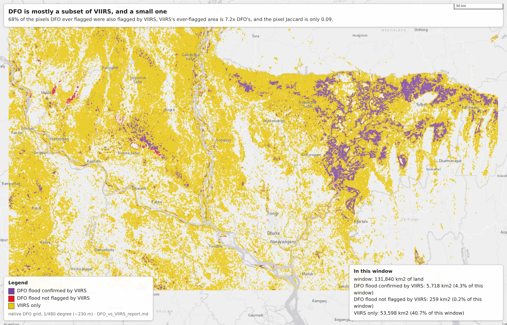
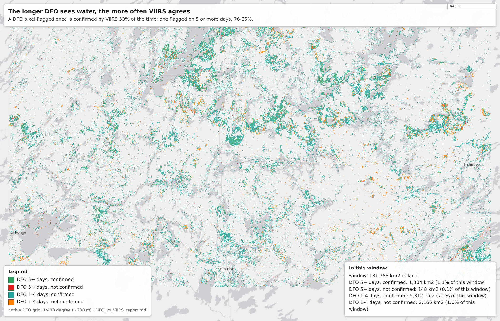
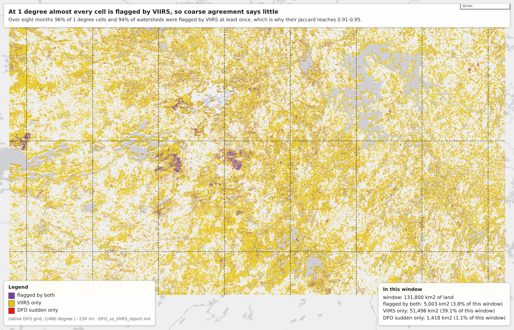
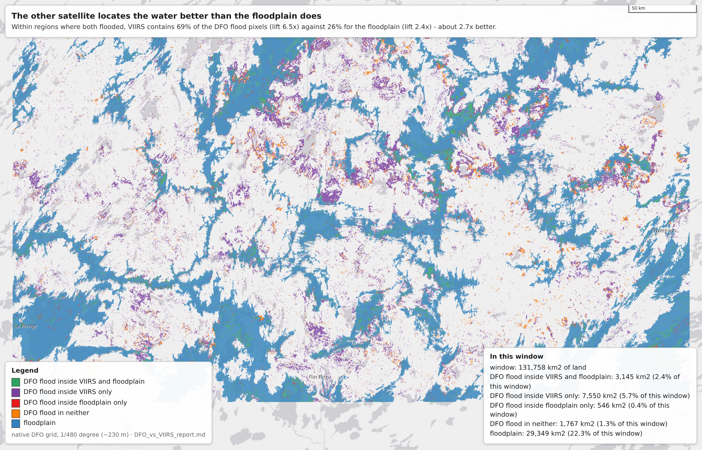
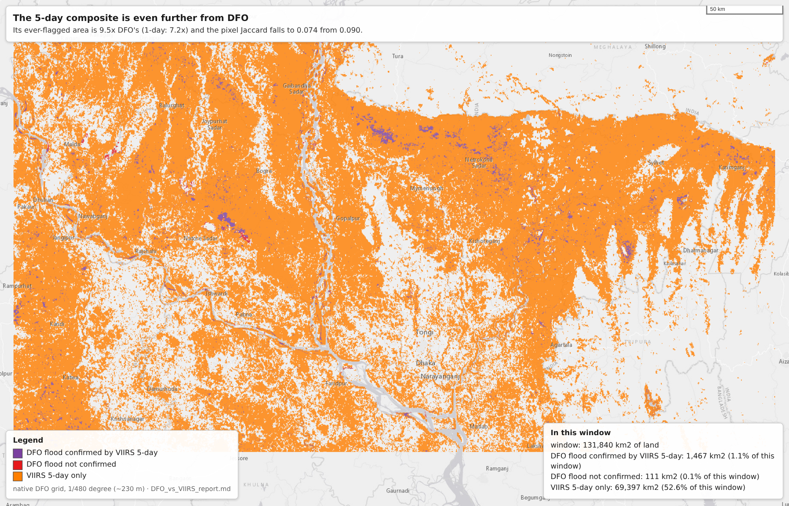
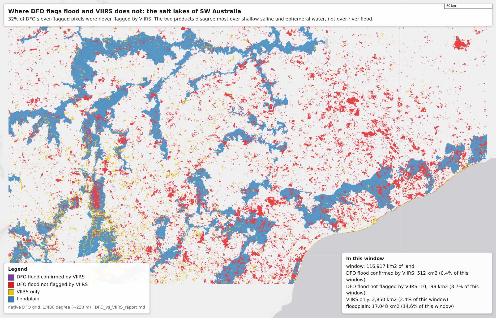

# DFO vs VIIRS: are they interchangeable, and do floodplains locate the water?

**Questions**
1. Can DFO flood data and VIIRS flood data (values 141–200) be used in place of each other?
2. Do river floodplains help predict where, inside a flooded region, the water will be?

**The main comparison is VIIRS against all DFO flood, regardless of type:** a DFO pixel counts as flooded if it was class 2 (recurrent) or class 3 (sudden). In every table that row comes first, in bold. The sudden and recurrent rows below it break the same comparison down by DFO flood type.

The comparison is done three ways:
- at pixel level on the DFO grid;
- at pixel level on the VIIRS grid;
- on a 0.1° grid where each product is aggregated from its own native grid, plus 0.5°, 1° and MoM watershed aggregates of that.

Sections 1–4 use the VIIRS **1-day** composite. [Section 5](#5-same-comparison-with-the-viirs-5-day-composite) repeats everything with the VIIRS **5-day** composite.

Companion reports: [DFO_report.md](DFO_report.md) and [VIIRS_report.md](VIIRS_report.md).

## Summary

- **No, they are not interchangeable.**
  - **DFO is mostly a subset of VIIRS.** 68% of the pixels DFO ever flagged as flood were also flagged by VIIRS.
  - **VIIRS flags far more.** Its ever-flagged area is 7.2x DFO's, and on an average day it flags 8.2x the area. Only 9% of VIIRS pixels were ever DFO flood.
  - **Pixel overlap is low.** The Jaccard index (both ÷ either) is 0.09.
- **Coarse agreement is better, but much of it is an artefact.**
  - Over eight months nearly every 1° cell (96%) and watershed (94%) is flagged by VIIRS at least once. So "both flagged at some point" (Jaccard 0.91–0.95) says little.
  - What is informative is how the products rank regions: Spearman 0.67–0.77 across watersheds and 1° cells.
  - That is moderate. Only 41 of each product's 100 most-flooded watersheds overlap, and VIIRS's area per watershed is a median 12x DFO's.
  - MoM scores both products' areas with **identical** weights (`DFO_Weightage.csv` and `VIIRS_Weightage.csv`: 100 km² per point, 1% per point, capped at 10). An area from one product therefore can't stand in for the other without rescaling.
- **The overlap is asymmetric, and persistence helps.**
  - A DFO flood pixel flagged once is confirmed by VIIRS 53% of the time; one flagged 5+ times, 76–85%.
  - In the other direction, even pixels VIIRS flagged on 30+ days were DFO flood only 34% of the time.
  - VIIRS can serve as a (much broader) superset of DFO. DFO can't reproduce VIIRS.
- **Floodplains are a coarse prior for both products, and weaker than the other satellite.**
  - Globally a floodplain pixel is 4.2x (DFO) and 3.2x (VIIRS) more likely to flood than other land.
  - Inside flooded 1° regions the figures are 4.9x and 3.2x.
  - But within regions where both products flooded, **the other product's footprint locates the water about 2.7x better than the floodplain**. VIIRS flags 69% of the DFO flood pixels there (lift 6.5x at 1°), against 26% of the floodplain (lift 2.4x).
  - So the floodplain says roughly where to look; an actual observation of flooding says much more precisely where the water is.
- **The VIIRS 5-day composite is, if anything, further from DFO.**
  - It contains slightly more of DFO: 72% of DFO flood pixels against 68% for the 1-day composite.
  - But its ever-flagged area is 9.5x DFO's (1-day: 7.2x), and its area per watershed a median 17x (1-day: 12x).
  - Pixel overlap is lower (Jaccard 0.074 against 0.090), as is the top-100 watershed overlap (35 against 41).
  - Rank agreement is the same (Spearman 0.67–0.76).
  - See [section 5](#5-same-comparison-with-the-viirs-5-day-composite).
- **By DFO flood type:** VIIRS agrees more with DFO recurrent flood than with sudden flood (85% against 62% of DFO pixels also flagged by VIIRS). Sudden flood follows floodplains no more than VIIRS does (3.3x against 3.2x); recurrent flood does so twice as strongly (7.2x).

## What the values mean

Both inputs are **accumulations**: per pixel, the number of daily rasters, over roughly eight months, in which the pixel had a given class. All aggregates here are built from them.

| | DFO | VIIRS |
|---|---|---|
| Source product | NASA LANCE MCDWD L3 "Flood 3-Day 250m" (MODIS), as staged by MoM | NOAA/CIMSS-GMU VIIRS 1-day flood composite, as staged by MoM |
| Rasters | 242, 2026-01-01 to 2026-08-31 | 236, 2026-01-07 to 2026-08-31 |
| Native grid | 1/480° (≈232 m at the equator), top 80°N | 0.003372° (≈375 m), top 75°N |
| Layers used | band 1: count of class 3 "flood (unusual)" = **sudden**; band 2: count of class 2 "recurring flood" = **recurrent** | band 1: count of values 141–200 = floodwater fraction above ~40% |
| What is *not* counted | class 1 "surface water" (matches the reference water map), class 0 no water, 255 insufficient data | everything ≤140: land, clouds and shadow, snow and ice, low floodwater fractions |
| Used by the MoM pipeline (per watershed) | class 3 only, counted in the 1-Day, 1-Day CS, 2-Day and 3-Day layers (`DFO_tool.py`, `dfo_extract_by_mask`) | 141–200, counted in the 1-day and 5-day composites (`VIIRS_tool.py:309`) |
| Layer accumulated for this analysis | 3-Day (the only DFO layer stored as images) | 1-day (sections 1–4) and 5-day (section 5) |
| Timing | each file is a 3-day composite, so one flood day can appear in up to 3 files | each file is one day |

Aggregates used in all three reports:

- **Ever flooded:** the count is > 0. "Flooded pixels" and "flooded share of land" are sums of this.
- **Mean daily flooded share:** count ÷ the number of rasters that observed the pixel, averaged over pixels. It is comparable even where the two products observed different days or footprints.
- **Risk ratio:** P(flooded | floodplain) ÷ P(flooded | other land).
- **Lift:** how much more often something is flooded on the given pixels than on the region's land overall.
- **Jaccard:** both ÷ either. It is 1 when two maps agree exactly and 0 when they never overlap.

**The two "flood" definitions differ in kind.**
- DFO subtracts water that matches its reference surface-water map (class 1). It then splits the rest into expected-seasonal (class 2) and unusual (class 3).
- VIIRS 141–200 makes no such split: anything mostly covered by floodwater counts, whether seasonal or not.
- Part of the VIIRS-only area is therefore probably water DFO calls normal or recurrent. The DFO class 1 count isn't in the accumulation, so this could not be tested.

## Analysis domain, and why the earlier river-plain reports overstated the effect

A pixel is in the domain if all of the following hold:
- it is **land** (inside a MoM watershed polygon);
- it is inside the GFPLAIN250m continental footprints, which end at 64.1°N;
- it was observed by at least 80% of the DFO rasters **and** at least 80% of the VIIRS rasters. South of 50°S only 183 of the 242 DFO rasters have coverage, so the domain is effectively **50°S to 64.1°N**.

Every layer and both products use this same domain, so their numbers can be compared directly.

**Why the land mask matters.** GFPLAIN maps floodplains only on land. But the source raster still stores a value everywhere: `0` is floodplain and `255` is "everything else". That second value covers non-floodplain land, the ocean and areas outside the tiles alike. The earlier reports (`dfo_accumulation/flood_vs_river_plains_report.md`, `viirs_accumulation/viirs_vs_river_plains_report.md`) used the continental bounding boxes as their domain. Those boxes are mostly sea; the Oceania box, for example, spans 139°W–180°E and 55°S–19°N. Ocean can never be flagged as flood, yet it was counted as "off floodplain". That pushed the off-floodplain flood rate down and every enrichment figure up.

| | old box domain | land-only domain (this report) |
|---|---|---|
| DFO grid pixels | 8,382,631,118 | 2,871,713,525 (34%) |
| VIIRS grid pixels | 3,330,051,622 | 1,096,128,286 (33%) |
| floodplain share of domain | 3.6% | 10.5% |
| risk ratio, DFO sudden (class 3) | 10.5x | **3.3x** |
| risk ratio, DFO recurrent (class 2) | 22.4x | **7.2x** |
| risk ratio, VIIRS 141-200 | 10.3x | **3.2x** |

The share of flooded pixels lying on floodplain doesn't change (28.2%, 45.9% and ~27%), because the numerator is the same. Only the denominator changes. Restricting the domain to land roughly divides the enrichment by three.

**Bin bug in the earlier reports.** The "floodplain share of a 0.1° cell" tables in the old reports are shifted by one bin. `np.digitize(..., right=True)` assigned cells with a (0, 1%] floodplain share to the "0%" row, and every later row likewise holds the next bin's cells. That is why ">75-100%" always showed 0 cells while ">50-75%" held the largest count. The tables below use correct bins. For example, the old ">50-75%" row's 70,563 cells correspond to the 70,691 cells in the ">75-100%" row here; the small difference comes from the land-only domain.

The domain is identical in all three comparisons: 2.87 billion DFO-grid pixels, or 1.10 billion VIIRS-grid pixels, of land between 50°S and 64.1°N.

## How the three comparisons differ

| comparison | DFO | VIIRS | effect of resampling |
|---|---|---|---|
| **DFO grid**, pixel level | native | `viirs_on_dfo_grid.tiff`, nearest neighbour | each VIIRS pixel is replicated onto ~2.6 DFO pixels; no counts are invented |
| **VIIRS grid**, pixel level | `dfo_on_viirs_grid.tiff`, nearest neighbour | native | each VIIRS-sized pixel takes the DFO value at its centre; ~60% of DFO pixels are not sampled, without systematic bias |
| **0.1° grid** (and 0.5°, 1°, watersheds) | own grid, summed per cell | own grid, summed per cell | none: each product keeps its own geometry |

The two pixel-level comparisons give practically identical results (tables below). The conclusions therefore don't depend on which product is resampled.

## 1. Pixel level

| DFO layer | grid | DFO pixels | VIIRS pixels | both | VIIRS/DFO extent | share of DFO also VIIRS | share of VIIRS also DFO | Jaccard | Jaccard on floodplain / other land |
|---|---|---|---|---|---|---|---|---|---|
| **DFO all floods (class 2+3)** | DFO | 37,351,308 | 270,651,332 | 25,332,657 | 7.2x | 67.8% | 9.4% | 0.090 | 0.132 / 0.074 |
| **DFO all floods (class 2+3)** | VIIRS | 14,253,758 | 103,322,537 | 9,696,549 | 7.2x | 68.0% | 9.4% | 0.090 | 0.132 / 0.074 |
| DFO sudden (class 3) | DFO | 27,901,613 | 270,651,332 | 17,277,732 | 9.7x | 61.9% | 6.4% | 0.061 | 0.080 / 0.055 |
| DFO sudden (class 3) | VIIRS | 10,647,689 | 103,322,537 | 6,614,810 | 9.7x | 62.1% | 6.4% | 0.062 | 0.080 / 0.055 |
| DFO recurrent (class 2) | DFO | 11,141,853 | 270,651,332 | 9,450,042 | 24.3x | 84.8% | 3.5% | 0.035 | 0.062 / 0.024 |
| DFO recurrent (class 2) | VIIRS | 4,251,685 | 103,322,537 | 3,615,323 | 24.3x | 85.0% | 3.5% | 0.035 | 0.062 / 0.025 |

- **DFO is mostly inside VIIRS.** 68% of the pixels DFO ever flagged as flood were also flagged by VIIRS at some point, rising to 82% on floodplain.
- **VIIRS is mostly outside DFO.** VIIRS's ever-flagged area is 7.2x DFO's, and on average days VIIRS flags 8.2x the area (mean daily flagged share 0.266% against 0.032% of land). Only 9.4% of VIIRS pixels were ever DFO flood.
- **Agreement is best on floodplains** (Jaccard 0.132 against 0.074 on other land). There both products see large, long-lived water.
- **By type:** 62% of DFO sudden-flood pixels and 85% of recurrent ones are also VIIRS. VIIRS's area is 9.7x sudden and 24x recurrent.

**Persistence** (DFO grid; the VIIRS grid gives the same to within 0.5 percentage points): the chance that the other product ever flagged a pixel, given how many rasters one product flagged it in. For "DFO all floods" the count is the number of rasters in which the pixel was class 2 or 3.

| days flagged by one product | 0 | 1 | 2-4 | 5-9 | 10-29 | 30+ |
|---|---|---|---|---|---|---|
| P(VIIRS ever \| **DFO all floods (class 2+3)** days) | 8.7% | 53.4% | 70.0% | 84.6% | 84.9% | 75.8% |
| P(VIIRS ever \| DFO sudden (class 3) days) | 8.9% | 51.5% | 66.6% | 81.9% | 80.3% | 74.0% |
| P(VIIRS ever \| DFO recurrent (class 2) days) | 9.1% | 82.7% | 84.5% | 86.8% | 86.2% | 78.1% |
| P(**DFO all floods (class 2+3)** ever \| VIIRS days) | 0.5% | 2.7% | 7.9% | 15.1% | 23.9% | 34.3% |
| P(DFO sudden (class 3) ever \| VIIRS days) | 0.4% | 2.4% | 6.2% | 10.0% | 14.0% | 20.3% |
| P(DFO recurrent (class 2) ever \| VIIRS days) | 0.1% | 0.4% | 1.9% | 5.7% | 11.3% | 18.5% |

- A DFO flood pixel seen once is confirmed by VIIRS only about half the time (53%). This rises to about 85% when DFO flagged it 5–29 times (76% at 30+).
  - Single DFO flags are therefore either short-lived floods VIIRS missed (cloud, overpass timing) or DFO false positives.
  - By type: recurrent-flood pixels are confirmed 78–87% of the time whatever the count; single sudden-flood flags only 52% of the time.
- For VIIRS the converse doesn't hold: even pixels flooded on 30+ VIIRS days were DFO flood only 34% of the time.
  - Long-lasting VIIRS water is largely water DFO either classes as normal surface water (class 1), which isn't counted here, or doesn't see.
  - The cause can't be separated with these accumulations.
- The dip at "30+" in the first rows (74–78%) comes from DFO pixels flagged on very many rasters that VIIRS never flags. These could be persistent DFO-only artefacts, but they weren't examined individually.

## 2. 0.1° grid, each product from its native grid

Cells are kept where both products' domains cover at least 10% of the cell. "Ever-flooded share" is the share of the cell's land flagged at least once. Spearman correlations are over cells flagged by either product.

| DFO layer | cell | cells | Jaccard: any flood | Jaccard: ≥1% flooded | Jaccard: ≥5% flooded | DFO cells also VIIRS (any) | VIIRS cells also DFO (any) | Spearman of ever-flooded share | Spearman of mean daily share | median VIIRS/DFO extent |
|---|---|---|---|---|---|---|---|---|---|---|
| **DFO all floods (class 2+3)** | 0.1° | 1,265,815 | 0.50 | 0.31 | 0.17 | 92.3% | 51.7% | 0.50 | 0.57 | 9.6x |
| **DFO all floods (class 2+3)** | 0.5° | 52,733 | 0.88 | 0.36 | 0.15 | 99.7% | 88.2% | 0.68 | 0.76 | 11.9x |
| **DFO all floods (class 2+3)** | 1° | 13,487 | 0.95 | 0.37 | 0.13 | 99.9% | 95.2% | 0.70 | 0.77 | 11.6x |
| DFO sudden (class 3) | 0.1° | 1,265,815 | 0.49 | 0.27 | 0.12 | 92.2% | 51.1% | 0.48 | 0.53 | 13.2x |
| DFO sudden (class 3) | 0.5° | 52,733 | 0.88 | 0.30 | 0.09 | 99.7% | 88.1% | 0.64 | 0.70 | 16.7x |
| DFO sudden (class 3) | 1° | 13,487 | 0.95 | 0.29 | 0.08 | 99.9% | 95.1% | 0.66 | 0.70 | 16.7x |
| DFO recurrent (class 2) | 0.1° | 1,265,815 | 0.28 | 0.14 | 0.05 | 99.3% | 27.9% | 0.59 | 0.65 | 29.5x |
| DFO recurrent (class 2) | 0.5° | 52,733 | 0.65 | 0.14 | 0.03 | 100.0% | 64.5% | 0.72 | 0.80 | 46.4x |
| DFO recurrent (class 2) | 1° | 13,487 | 0.83 | 0.14 | 0.02 | 100.0% | 82.6% | 0.74 | 0.80 | 47.0x |

- **At 0.1° the products agree on whether a cell flooded about half the time** (Jaccard 0.50).
  - 92% of DFO-flooded cells are also VIIRS cells.
  - Only 52% of VIIRS cells contain any DFO flood.
- **As the threshold rises, agreement falls.** At "≥1% of the cell flooded" the Jaccard drops to 0.31, and at "≥5%" to 0.17, because VIIRS extents are an order of magnitude larger. In cells both flagged, VIIRS's extent is a median 9.6x DFO's at 0.1° and 11.6x at 1°.
- **At 1°, "any flood" agreement (0.95) is saturation, not skill.** 96% of usable 1° cells are VIIRS-flagged at some point in the period.
- **Rank agreement (Spearman) improves from 0.50 at 0.1° to 0.70 at 1°** (0.57 and 0.77 for mean daily share). The products agree on *which* areas flood a lot much better than on *where exactly* or *how much*.
- **By type:** recurrent flood ranks most similarly to VIIRS (Spearman of mean daily share 0.80 at 1°), but its cells hold only 28% of VIIRS cells at 0.1°.

## 3. MoM watersheds

Cell sums are aggregated per watershed (`pfaf_id`, rasterised at 0.1°). These are the units MoM scores.

| DFO layer | watersheds | flagged by DFO / VIIRS / both | Jaccard | Spearman of ever-flooded share | Spearman of mean daily share | median VIIRS/DFO extent | top-100 overlap (mean daily share) |
|---|---|---|---|---|---|---|---|
| **DFO all floods (class 2+3)** | 14,316 | 12,432 / 13,526 / 12,396 | 0.91 | 0.67 | 0.75 | 11.9x | 41 of 100 |
| DFO sudden (class 3) | 14,316 | 12,402 / 13,526 / 12,366 | 0.91 | 0.62 | 0.68 | 17.5x | 29 of 100 |
| DFO recurrent (class 2) | 14,316 | 10,189 / 13,526 / 10,188 | 0.75 | 0.72 | 0.79 | 48.0x | 32 of 100 |

- 94% of watersheds were flagged by VIIRS at least once in eight months, so the 0.91 Jaccard mostly reflects that.
- What matters for MoM is the *size* of the signal:
  - The median VIIRS area per watershed is 11.9x DFO's, or 17.5x if only DFO class 3 is counted, as `DFO_tool.py` does.
  - Both are scored with identical area weights (100 km² per point, 1% per point, capped at 10, then multiplied by a recency factor).
  - VIIRS will therefore hit the caps far more often than DFO for the same event.
- Of the 100 watersheds with the highest mean daily flagged share, 41 are shared between DFO and VIIRS (29 for DFO sudden flood only).

## 4. Do floodplains help locate the water, compared with the other product?

The table covers regions where **both** products flooded at least once and that contain floodplain. "Rate on X" is the share of X's pixels the product flagged; lift divides it by the product's share of the region's land. (DFO grid; the VIIRS grid differs by under 0.2 in any lift.)

| DFO layer | region size | regions | VIIRS share of land | VIIRS rate on DFO pixels (lift) | VIIRS rate on floodplain (lift) | DFO share of land | DFO rate on VIIRS pixels (lift) | DFO rate on floodplain (lift) |
|---|---|---|---|---|---|---|---|---|
| **DFO all floods (class 2+3)** | 0.1° | 209,113 | 23.5% | 75.5% (3.2x) | 34.5% (1.5x) | 3.81% | 12.3% (3.2x) | 6.6% (1.7x) |
| **DFO all floods (class 2+3)** | 0.5° | 31,386 | 11.8% | 69.9% (5.9x) | 26.9% (2.3x) | 1.51% | 8.9% (5.9x) | 4.5% (3.0x) |
| **DFO all floods (class 2+3)** | 1° | 9,815 | 10.6% | 69.1% (6.5x) | 25.9% (2.4x) | 1.35% | 8.8% (6.5x) | 4.3% (3.2x) |
| DFO sudden (class 3) | 0.1° | 206,565 | 23.6% | 69.7% (3.0x) | 34.6% (1.5x) | 2.68% | 7.9% (3.0x) | 4.3% (1.6x) |
| DFO sudden (class 3) | 0.5° | 31,335 | 11.8% | 63.7% (5.4x) | 26.9% (2.3x) | 1.11% | 6.0% (5.4x) | 2.9% (2.6x) |
| DFO sudden (class 3) | 1° | 9,806 | 10.6% | 62.8% (5.9x) | 25.9% (2.4x) | 0.99% | 5.9% (5.9x) | 2.8% (2.8x) |
| DFO recurrent (class 2) | 0.1° | 118,167 | 31.3% | 88.6% (2.8x) | 42.5% (1.4x) | 2.39% | 6.8% (2.8x) | 4.4% (1.9x) |
| DFO recurrent (class 2) | 0.5° | 23,644 | 14.5% | 86.7% (6.0x) | 30.4% (2.1x) | 0.63% | 3.8% (6.0x) | 2.3% (3.6x) |
| DFO recurrent (class 2) | 1° | 8,725 | 11.7% | 86.0% (7.4x) | 27.5% (2.4x) | 0.48% | 3.5% (7.4x) | 2.0% (4.1x) |

**For locating VIIRS water inside a jointly flooded 1° region, the DFO footprint is 2.7x more informative than the floodplain:**
- 69% of DFO flood pixels are VIIRS water (lift 6.5x), against 26% of floodplain pixels (lift 2.4x).
- In the other direction, 8.8% of VIIRS pixels are DFO flood (lift 6.5x), against 4.3% of floodplain (3.2x).

The floodplain is the larger target. It covers 14% of land and holds about a third of VIIRS water, while DFO flood covers 1.4% of land and catches 9% of it. As a *location* signal, however, an observed flood beats the static floodplain at every scale and for every DFO flood type.

Floodplain enrichment, measured identically for each product:

| | risk ratio, all land | risk ratio inside flooded 1° regions | flood on floodplain inside flooded 1° regions (floodplain = ~14% of land) |
|---|---|---|---|
| **DFO all floods (class 2+3)** | **4.2x** | **4.9x** | **43%** |
| VIIRS 141-200 | 3.2x | 3.2x | 33% |
| DFO sudden (class 3) | 3.3x | 3.8x | 38% |
| DFO recurrent (class 2) | 7.2x | 8.5x | 58% |

DFO flood is somewhat more floodplain-bound than VIIRS. All of that difference comes from recurrent flood: DFO sudden flood and VIIRS are equally (and only weakly) tied to floodplains.

## 5. Same comparison with the VIIRS 5-day composite

**About the 5-day composite.** It fills cloud and orbit gaps with the most recent of the last 5 days of clear observations. One flood day can therefore appear in up to 5 consecutive composites, so 5-day "days" are composite counts, not distinct days. The accumulation `viirs5day_merged/viirs5day_janaug.tiff` covers 236 composites, 2026-01-07 to 2026-08-31 (without 2026-05-05). It was compared with DFO exactly as above:
- on the DFO grid via `viirs5day_merged/viirs5day_janaug_on_dfo_grid.tiff`;
- on the VIIRS grid with DFO from `dfo_on_viirs_grid.tiff`;
- on the 0.1° grid from both native grids.

The land domain is identical to sections 1–4.

**Pixel level**

| DFO layer | grid | DFO pixels | VIIRS pixels | both | VIIRS/DFO extent | share of DFO also VIIRS | share of VIIRS also DFO | Jaccard | Jaccard on floodplain / other land |
|---|---|---|---|---|---|---|---|---|---|
| **DFO all floods (class 2+3)** | DFO | 37,351,308 | 354,721,788 | 26,898,567 | 9.5x | 72.0% | 7.6% | 0.074 | 0.113 / 0.060 |
| **DFO all floods (class 2+3)** | VIIRS | 14,253,758 | 135,411,055 | 10,290,714 | 9.5x | 72.2% | 7.6% | 0.074 | 0.113 / 0.061 |
| DFO sudden (class 3) | DFO | 27,901,613 | 354,721,788 | 18,613,015 | 12.7x | 66.7% | 5.2% | 0.051 | 0.069 / 0.045 |
| DFO sudden (class 3) | VIIRS | 10,647,689 | 135,411,055 | 7,122,388 | 12.7x | 66.9% | 5.3% | 0.051 | 0.069 / 0.045 |
| DFO recurrent (class 2) | DFO | 11,141,853 | 354,721,788 | 9,714,870 | 31.8x | 87.2% | 2.7% | 0.027 | 0.051 / 0.019 |
| DFO recurrent (class 2) | VIIRS | 4,251,685 | 135,411,055 | 3,714,854 | 31.8x | 87.4% | 2.7% | 0.027 | 0.051 / 0.019 |

**Persistence** (DFO grid). "VIIRS days" are 5-day composite counts.

| days flagged by one product | 0 | 1 | 2-4 | 5-9 | 10-29 | 30+ |
|---|---|---|---|---|---|---|
| P(VIIRS ever \| **DFO all floods (class 2+3)** days) | 11.6% | 58.8% | 74.8% | 87.0% | 86.7% | 76.9% |
| P(VIIRS ever \| DFO sudden (class 3) days) | 11.8% | 56.9% | 71.8% | 84.4% | 81.8% | 74.6% |
| P(VIIRS ever \| DFO recurrent (class 2) days) | 12.1% | 85.9% | 87.3% | 89.0% | 88.0% | 79.4% |
| P(**DFO all floods (class 2+3)** ever \| VIIRS days) | 0.4% | 1.4% | 2.0% | 2.9% | 8.1% | 22.1% |
| P(DFO sudden (class 3) ever \| VIIRS days) | 0.4% | 1.3% | 1.8% | 2.6% | 6.1% | 12.9% |
| P(DFO recurrent (class 2) ever \| VIIRS days) | 0.1% | 0.1% | 0.2% | 0.3% | 2.2% | 10.9% |

**0.1° grid, each product from its native grid**

| DFO layer | cell | cells | Jaccard: any flood | Jaccard: ≥1% flooded | Jaccard: ≥5% flooded | DFO cells also VIIRS (any) | VIIRS cells also DFO (any) | Spearman of ever-flooded share | Spearman of mean daily share | median VIIRS/DFO extent |
|---|---|---|---|---|---|---|---|---|---|---|
| **DFO all floods (class 2+3)** | 0.1° | 1,265,815 | 0.48 | 0.28 | 0.14 | 96.0% | 49.2% | 0.53 | 0.59 | 12.8x |
| **DFO all floods (class 2+3)** | 0.5° | 52,733 | 0.88 | 0.34 | 0.12 | 99.8% | 87.7% | 0.67 | 0.75 | 17.5x |
| **DFO all floods (class 2+3)** | 1° | 13,487 | 0.95 | 0.35 | 0.11 | 100.0% | 94.7% | 0.70 | 0.76 | 16.6x |
| DFO sudden (class 3) | 0.1° | 1,265,815 | 0.48 | 0.25 | 0.10 | 95.9% | 48.7% | 0.51 | 0.55 | 17.5x |
| DFO sudden (class 3) | 0.5° | 52,733 | 0.87 | 0.28 | 0.08 | 99.8% | 87.5% | 0.64 | 0.69 | 24.6x |
| DFO sudden (class 3) | 1° | 13,487 | 0.95 | 0.28 | 0.06 | 100.0% | 94.6% | 0.66 | 0.69 | 24.4x |
| DFO recurrent (class 2) | 0.1° | 1,265,815 | 0.26 | 0.12 | 0.04 | 99.8% | 25.7% | 0.57 | 0.64 | 37.1x |
| DFO recurrent (class 2) | 0.5° | 52,733 | 0.64 | 0.13 | 0.02 | 100.0% | 64.0% | 0.70 | 0.80 | 66.5x |
| DFO recurrent (class 2) | 1° | 13,487 | 0.82 | 0.13 | 0.02 | 100.0% | 82.2% | 0.72 | 0.80 | 68.1x |

**MoM watersheds**

| DFO layer | watersheds | flagged by DFO / VIIRS / both | Jaccard | Spearman of ever-flooded share | Spearman of mean daily share | median VIIRS/DFO extent | top-100 overlap (mean daily share) |
|---|---|---|---|---|---|---|---|
| **DFO all floods (class 2+3)** | 14,316 | 12,432 / 13,624 / 12,417 | 0.91 | 0.67 | 0.74 | 17.2x | 35 of 100 |
| DFO sudden (class 3) | 14,316 | 12,402 / 13,624 / 12,387 | 0.91 | 0.63 | 0.67 | 25.0x | 22 of 100 |
| DFO recurrent (class 2) | 14,316 | 10,189 / 13,624 / 10,188 | 0.75 | 0.71 | 0.78 | 68.6x | 29 of 100 |

**Locating the water: other product against floodplain** (regions both flooded, DFO grid)

| DFO layer | region size | regions | VIIRS share of land | VIIRS rate on DFO pixels (lift) | VIIRS rate on floodplain (lift) | DFO share of land | DFO rate on VIIRS pixels (lift) | DFO rate on floodplain (lift) |
|---|---|---|---|---|---|---|---|---|
| **DFO all floods (class 2+3)** | 0.1° | 213,320 | 28.2% | 79.1% (2.8x) | 41.0% (1.4x) | 3.76% | 10.5% (2.8x) | 6.6% (1.7x) |
| **DFO all floods (class 2+3)** | 0.5° | 31,438 | 15.3% | 74.2% (4.8x) | 33.0% (2.2x) | 1.51% | 7.3% (4.8x) | 4.5% (3.0x) |
| **DFO all floods (class 2+3)** | 1° | 9,821 | 13.9% | 73.3% (5.3x) | 31.9% (2.3x) | 1.35% | 7.1% (5.3x) | 4.3% (3.2x) |
| DFO sudden (class 3) | 0.1° | 210,768 | 28.3% | 74.1% (2.6x) | 41.0% (1.4x) | 2.65% | 6.9% (2.6x) | 4.2% (1.6x) |
| DFO sudden (class 3) | 0.5° | 31,387 | 15.3% | 68.8% (4.5x) | 33.0% (2.2x) | 1.11% | 5.0% (4.5x) | 2.9% (2.6x) |
| DFO sudden (class 3) | 1° | 9,812 | 13.9% | 67.9% (4.9x) | 31.9% (2.3x) | 0.99% | 4.8% (4.9x) | 2.8% (2.8x) |
| DFO recurrent (class 2) | 0.1° | 118,336 | 36.3% | 90.3% (2.5x) | 49.0% (1.3x) | 2.39% | 5.9% (2.5x) | 4.4% (1.9x) |
| DFO recurrent (class 2) | 0.5° | 23,644 | 18.4% | 88.6% (4.8x) | 36.9% (2.0x) | 0.63% | 3.0% (4.8x) | 2.3% (3.6x) |
| DFO recurrent (class 2) | 1° | 8,725 | 15.2% | 87.8% (5.8x) | 33.8% (2.2x) | 0.48% | 2.8% (5.8x) | 2.0% (4.1x) |

**Summary of the 5-day comparison, against all DFO flood (1-day values in brackets)**
- **Containment:** 72% of DFO flood pixels are also VIIRS 5-day (68%), and only 7.6% of VIIRS 5-day pixels are DFO (9.4%). The Jaccard index is 0.074 (0.090).
- **Extent:** VIIRS 5-day's ever-flagged area is 9.5x DFO's (7.2x). Its mean daily flagged share of land is 1.114% against DFO's 0.032%, which is 34x (8.2x). Much of that comes from the 5-day composite counting each flood day up to 5 times.
- **Persistence:**
  - A DFO pixel flagged once is VIIRS 5-day 59% of the time (53%); one flagged 5–29 times, 87% (85%).
  - Pixels flagged in 30+ 5-day composites are DFO flood only 22% of the time (34%). The 5-day product keeps far more pixels at high counts that DFO never flags.
- **0.1° cells:**
  - Jaccard is 0.48 for "any flood" (0.50), 0.28 at ≥1% (0.31) and 0.14 at ≥5% (0.17).
  - 96% of DFO cells are VIIRS 5-day cells (92%), and 49% of VIIRS 5-day cells contain DFO (52%).
  - Spearman is 0.53 and 0.59 (0.50 and 0.57); at 1°, 0.70 and 0.76 (0.70 and 0.77).
- **Watersheds:**
  - 95% of watersheds are flagged by VIIRS 5-day at least once (94%), and the Jaccard is 0.91 (0.91).
  - Spearman is 0.67 and 0.74 (0.67 and 0.75), and the top-100 overlap is 35 (41).
  - The median VIIRS/DFO area is **17x** (12x), or **25x** against class 3 alone (17.5x).
- **Locating the water:** in jointly flooded 1° regions, 73% of DFO flood pixels are VIIRS 5-day water (lift 5.3x), against 32% of floodplain pixels (lift 2.3x). The DFO footprint is still 2.3x more informative than the floodplain (2.7x).
- **Floodplain enrichment:** for VIIRS 5-day it is 2.9x over all land and 2.9x within flooded 1° regions (3.2x and 3.2x), against 4.2x and 4.9x for DFO.

The 5-day composite contains DFO slightly better because it fills cloud gaps. Otherwise it moves *further* from DFO: larger extents, lower overlap, and a lower top-100 overlap, with the same moderate rank agreement. It is no more interchangeable with DFO than the 1-day composite. If anything it needs a larger rescaling factor (about 17x per watershed against all DFO flood).

## Conclusions

1. **DFO and VIIRS are not mutually replaceable** at pixel, 0.1°, 1° or watershed level.
   - DFO flood is roughly a high-confidence subset of VIIRS.
   - VIIRS adds about 7x more area: some of it is real flood DFO misses, some is likely water DFO treats as normal surface water, and some looks like high-latitude and Patagonian artefacts (see [VIIRS_report.md](VIIRS_report.md)).
   - If one product is to stand in for the other in MoM, its areas need rescaling. The median per-watershed ratio is about 12x, or about 17x against the class-3-only DFO area the MoM pipeline uses. Both ratios come from the 3-Day DFO layer (the only DFO layer stored as images) and the 1-day VIIRS composite. The pipeline's 1-Day and 2-Day DFO areas, and its 5-day VIIRS areas, may scale differently. The two also rank watersheds only moderately alike (Spearman ≈ 0.7).
   - The same holds for the VIIRS 5-day composite, which needs an even larger rescaling (median ~17x per watershed against all DFO flood, ~25x against class 3) and overlaps DFO less at pixel level (Jaccard 0.074).
2. **Combining them is more useful than substituting one for the other.**
   - Pixels flagged by both are strongly confirmed: about 85% of DFO pixels flagged 5–29 times are also VIIRS.
   - DFO-only single flags and VIIRS-only high-latitude flags are where most disagreement sits.
3. **River floodplains help predict where in a flooded region the water goes, but only as a coarse prior.**
   - Inside flooded 1° regions they hold 3–5x more flood per pixel than other land (8.5x for DFO recurrent flood).
   - Most flood pixels (67–73% across the whole domain) still lie off the floodplain, and 18–25% lie in flooded 1° regions with no mapped floodplain at all (north of 60°N, arid areas, non-riverine flooding).
   - 75–96% of floodplain pixels stay dry over eight months.
   - A concurrent observation from the other satellite locates the water about 2.7x better.

## Caveats

- **Totals only.** These are totals over the whole period. "Both flagged" means both flagged the pixel at some point, not on the same day, so same-day agreement is certainly lower. Testing it needs the daily rasters, not the accumulations.
- **Slight date offset.** DFO starts 6 days earlier (2026-01-01 against 2026-01-07). The per-pixel normalisation by observing rasters absorbs this for daily shares, but not for "ever flagged".
- **3-day composites.** DFO counts are counts of 3-day composites. For comparisons of days, a DFO count of n corresponds to fewer distinct flood days.
- **Unknown causes.** The causes behind DFO-only and VIIRS-only areas (cloud, overpass timing, reference-water handling, snow and ice, lakes) can't be separated with these inputs. Statements about them are labelled as hypotheses.

## How to reproduce

Every VIIRS 1-day number in this report comes from `report/data/flood_overlap_metrics.json`, and every VIIRS 5-day number from `report/data/flood_overlap_metrics_viirs5day.json`. All scripts are in `validation_scripts/`; run them from that directory with the `myenv` conda environment (`/root/miniconda3/envs/myenv/bin/python`).

1. **Build the extra inputs** with [`build_report_inputs.sh`](../build_report_inputs.sh). It's idempotent and skips files that already exist.
   - `dfo_accumulation/dfo_on_viirs_grid.tiff`: DFO counts resampled onto the VIIRS grid (`gdalwarp -r near`).
   - `viirs5day_merged/viirs5day_janaug_on_dfo_grid.tiff`: VIIRS 5-day counts resampled onto the DFO grid (`gdalwarp -r near`).
   - `dfo_accumulation/dfo_land_mask.tiff` and `viirs_accumulation/viirs_land_mask.tiff`: land masks on the DFO and VIIRS grids, rasterised from `../data/watershed_shp`.
   - `report/data/watersheds_0p1deg.tiff`: MoM `pfaf_id` per 0.1° cell.
   ```bash
   bash build_report_inputs.sh
   ```
2. **One pass per grid** with [`flood_overlap_pass.py`](../flood_overlap_pass.py). Each pass reduces every pixel to 0.1° cell sums. Each pass takes ~10–30 min on an idle host, and up to ~1.5 h when other jobs compete for the 2 cores.
   ```bash
   # VIIRS 1-day
   python flood_overlap_pass.py --grid-name dfo_grid \
     --dfo dfo_accumulation/dfo_accumulater.tiff --viirs viirs_accumulation/viirs_on_dfo_grid.tiff \
     --dfo-meta dfo_accumulation/dfo_accumulater_metadata.json \
     --viirs-meta viirs_accumulation/viirs_accumulater_metadata.json \
     --plain dfo_accumulation/river_plains_mask.tiff \
     --plain-meta viirs_accumulation/river_plains_mask_metadata.json \
     --land dfo_accumulation/dfo_land_mask.tiff --window-rows 48 --out report/data/pass_dfo_grid.npz

   python flood_overlap_pass.py --grid-name viirs_grid \
     --dfo dfo_accumulation/dfo_on_viirs_grid.tiff --viirs viirs_accumulation/viirs_accumulater.tiff \
     --dfo-meta dfo_accumulation/dfo_accumulater_metadata.json \
     --viirs-meta viirs_accumulation/viirs_accumulater_metadata.json \
     --plain viirs_accumulation/river_plains_mask.tiff \
     --plain-meta viirs_accumulation/river_plains_mask_metadata.json \
     --land viirs_accumulation/viirs_land_mask.tiff --window-rows 40 --out report/data/pass_viirs_grid.npz

   # VIIRS 5-day
   python flood_overlap_pass.py --grid-name dfo_grid \
     --dfo dfo_accumulation/dfo_accumulater.tiff --viirs viirs5day_merged/viirs5day_janaug_on_dfo_grid.tiff \
     --dfo-meta dfo_accumulation/dfo_accumulater_metadata.json \
     --viirs-meta viirs5day_merged/viirs5day_janaug_metadata.json \
     --plain dfo_accumulation/river_plains_mask.tiff \
     --plain-meta viirs_accumulation/river_plains_mask_metadata.json \
     --land dfo_accumulation/dfo_land_mask.tiff --window-rows 48 --out report/data/pass_viirs5day_dfo_grid.npz

   python flood_overlap_pass.py --grid-name viirs_grid \
     --dfo dfo_accumulation/dfo_on_viirs_grid.tiff --viirs viirs5day_merged/viirs5day_janaug.tiff \
     --dfo-meta dfo_accumulation/dfo_accumulater_metadata.json \
     --viirs-meta viirs5day_merged/viirs5day_janaug_metadata.json \
     --plain viirs_accumulation/river_plains_mask.tiff \
     --plain-meta viirs_accumulation/river_plains_mask_metadata.json \
     --land viirs_accumulation/viirs_land_mask.tiff --window-rows 40 --out report/data/pass_viirs5day_viirs_grid.npz
   ```
   The DFO-grid passes read the GFPLAIN continental footprints from the VIIRS mask's metadata. The footprints are geographic boxes, identical in both `river_plains_mask_metadata.json` files, so it makes no difference which one is used.
3. **Compute every statistic** with [`flood_overlap_metrics.py`](../flood_overlap_metrics.py). Takes ~25 s and needs ~1.4 GB of RAM.
   ```bash
   python flood_overlap_metrics.py --dfo-grid report/data/pass_dfo_grid.npz \
     --viirs-grid report/data/pass_viirs_grid.npz --pfaf report/data/watersheds_0p1deg.tiff \
     --out-json report/data/flood_overlap_metrics.json

   python flood_overlap_metrics.py --dfo-grid report/data/pass_viirs5day_dfo_grid.npz \
     --viirs-grid report/data/pass_viirs5day_viirs_grid.npz --pfaf report/data/watersheds_0p1deg.tiff \
     --out-json report/data/flood_overlap_metrics_viirs5day.json
   ```

Inputs:
- `dfo_accumulation/dfo_accumulater.tiff`: 242 daily MCDWD "Flood 3-Day 250m" rasters, 2026-01-01 to 2026-08-31.
- `viirs_accumulation/viirs_accumulater.tiff`: 236 daily VIIRS 1-day composites, 2026-01-07 to 2026-08-31.
- `viirs5day_merged/viirs5day_janaug.tiff`: 236 daily VIIRS 5-day composites, 2026-01-07 to 2026-08-31 without 2026-05-05, merged from parts A, B, R1–R4 and E.
- The GFPLAIN250m `river_plains_mask.tiff` on each grid.


## Figures

One map per conclusion above, each on a small sample window, rendered in the same stack
as the MoM map itself (MapLibre GL with the OpenFreeMap positron basemap) and
screenshotted with Playwright. The classes are mutually exclusive and come from the very
rasters the report is computed from, so a figure can be read as a picture of one row of
one table. Every figure repeats its statistic for its own window, which is why those
numbers differ from the global ones: a window is chosen to show the effect, not to be
representative. Code: `figures_src/make_figures.py`, `figures_src/web/fig_page.html`,
`figures_src/shoot.js`.

### DFO is mostly a subset of VIIRS, and a small one



68% of the pixels DFO ever flagged were also flagged by VIIRS, VIIRS's ever-flagged area is 7.2x DFO's, and the pixel Jaccard is only 0.09.

Window 23.2N-25.6N, 87.8E-92.6E, native DFO grid, 1/480 degree (~230 m). window: 131,840 km2 of land:

- DFO flood confirmed by VIIRS: 5,718 km2 (4.3% of this window)
- DFO flood not flagged by VIIRS: 259 km2 (0.2% of this window)
- VIIRS only: 53,598 km2 (40.7% of this window)

### The longer DFO sees water, the more often VIIRS agrees



A DFO pixel flagged once is confirmed by VIIRS 53% of the time; one flagged on 5 or more days, 76-85%.

Window 54.6N-57.0N, 105.5W-97.5W, native DFO grid, 1/480 degree (~230 m). window: 131,758 km2 of land:

- DFO 5+ days, confirmed: 1,384 km2 (1.1% of this window)
- DFO 5+ days, not confirmed: 148 km2 (0.1% of this window)
- DFO 1-4 days, confirmed: 9,312 km2 (7.1% of this window)
- DFO 1-4 days, not confirmed: 2,165 km2 (1.6% of this window)

### At 1 degree almost every cell is flagged by VIIRS, so coarse agreement says little



Over eight months 96% of 1 degree cells and 94% of watersheds were flagged by VIIRS at least once, which is why their Jaccard reaches 0.91-0.95.

Window 52.6N-55.0N, 75.3W-67.7W, native DFO grid, 1/480 degree (~230 m). window: 131,800 km2 of land:

- flagged by both: 5,003 km2 (3.8% of this window)
- VIIRS only: 51,496 km2 (39.1% of this window)
- DFO sudden only: 1,418 km2 (1.1% of this window)

### The other satellite locates the water better than the floodplain does



Within regions where both flooded, VIIRS contains 69% of the DFO flood pixels (lift 6.5x) against 26% for the floodplain (lift 2.4x) - about 2.7x better.

Window 54.6N-57.0N, 105.5W-97.5W, native DFO grid, 1/480 degree (~230 m). window: 131,758 km2 of land:

- DFO flood inside VIIRS and floodplain: 3,145 km2 (2.4% of this window)
- DFO flood inside VIIRS only: 7,550 km2 (5.7% of this window)
- DFO flood inside floodplain only: 546 km2 (0.4% of this window)
- DFO flood in neither: 1,767 km2 (1.3% of this window)
- floodplain: 29,349 km2 (22.3% of this window)

### The 5-day composite is even further from DFO



Its ever-flagged area is 9.5x DFO's (1-day: 7.2x) and the pixel Jaccard falls to 0.074 from 0.090.

Window 23.2N-25.6N, 87.8E-92.6E, native DFO grid, 1/480 degree (~230 m). window: 131,840 km2 of land:

- DFO flood confirmed by VIIRS 5-day: 1,467 km2 (1.1% of this window)
- DFO flood not confirmed: 111 km2 (0.1% of this window)
- VIIRS 5-day only: 69,397 km2 (52.6% of this window)

### Where DFO flags flood and VIIRS does not: the salt lakes of SW Australia



32% of DFO's ever-flagged pixels were never flagged by VIIRS. The two products disagree most over shallow saline and ephemeral water, not over river flood.

Window 33.4S-31.0S, 120.9E-126.1E, native DFO grid, 1/480 degree (~230 m). window: 116,917 km2 of land:

- DFO flood confirmed by VIIRS: 512 km2 (0.4% of this window)
- DFO flood not flagged by VIIRS: 10,199 km2 (8.7% of this window)
- VIIRS only: 2,850 km2 (2.4% of this window)
- floodplain: 17,048 km2 (14.6% of this window)
